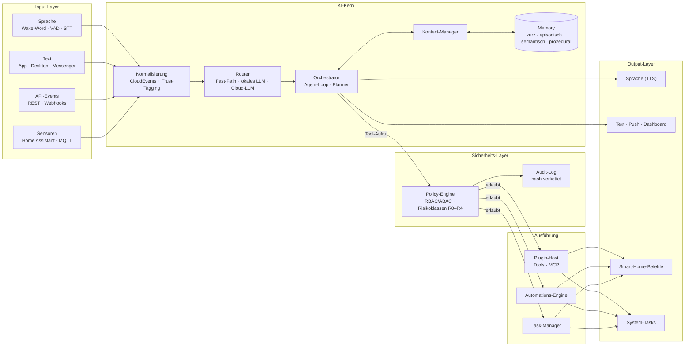

# JARVIS – Modulares KI-Assistenzsystem

> **J**ust **A** **R**ather **V**ery **I**ntelligent **S**ystem – als echtes, implementierbares System definiert,
> nicht als Film-Imitation.

JARVIS ist eine Referenzarchitektur für einen persönlichen KI-Assistenten, der Sprache, Text, API-Events und
Sensordaten versteht, über mehrere Schritte planen kann, das Smart Home steuert, recherchiert, kommuniziert,
Systeme diagnostiziert und proaktiv handelt – abgesichert durch eine Policy-Engine mit Risikoklassen,
Bestätigungs-Workflows und lückenlosem Audit-Log. Die Jarvis-Persona (höflich, britisch-präzise, subtil humorvoll)
ist eine optional aktivierbare Schicht über dem technischen Kern.

Dieses Repository enthält das **vollständige technische Konzept**, maschinenlesbare **Schemas und API-Blueprints**
sowie ein **Referenz-Skelett** in Python und Node.js, dessen Kernlogik offline getestet wird.

## Architektur auf einen Blick



## Dokumentation

| # | Abschnitt | Inhalt |
|---|-----------|--------|
| 1 | [Kurze Zusammenfassung](docs/01-zusammenfassung.md) | Vision, Designprinzipien, Kennzahlen, Technologie-Stack |
| 2 | [Komplette Architektur](docs/02-architektur.md) | KI-Kern, Input/Output, Automations-Engine, Entscheidungslogik, Sicherheit, Plugins, APIs, Deployment |
| 3 | [Module & Funktionen](docs/03-module-und-funktionen.md) | Vollständiger Funktionsumfang, Modul-Design mit Schnittstellen und Datenfluss |
| 4 | [Technische Umsetzung](docs/04-technische-umsetzung.md) | API-Blueprints, JSON-Schemas, Requests/Responses, Datenbank, Event-Flow, Error-Handling, Logging |
| 5 | [Code-Beispiele](docs/05-code-beispiele.md) | Python, JavaScript/Node, Home Assistant, MQTT, Node-RED – geführte Tour durch den Referenzcode |
| 6 | [Integrationsplan](docs/06-integrationsplan.md) | Home Assistant, Node-RED, MQTT, REST, Webhooks, lokale & Cloud-Modelle, Apps, Voice-Frontend, Roadmap |
| 7 | [Jarvis-Persona (optional)](docs/07-jarvis-persona.md) | Persona-Parameter, Voice-Style-Guide, Antwort-Beispiele |
| 8 | [Erweiterungen & Zukunft](docs/08-erweiterungen.md) | Ausbaustufen, Forschungsthemen, Risiken |

## Repository-Struktur

```
.
├── CHANGELOG.md              Änderungen des Jarvis-Moduls (Versionen)
├── docs/                     Konzept in 8 Abschnitten
├── api/openapi.yaml          REST/WebSocket-Blueprint (OpenAPI 3.1)
├── schemas/                  JSON-Schemas (Draft 2020-12) + validierte Beispiel-Payloads
├── config/                   Systemkonfiguration, Policies, Persona
├── db/schema.sql             PostgreSQL 16 + pgvector
├── reference/
│   ├── python/               Kern-Skelett: Orchestrator, LLM-Gateway, Policy, Memory, Automationen, Connectoren
│   ├── node/                 WebSocket-Client, Webhook-Relay, MQTT-Geräteadapter, Plugin-Beispiel
│   └── web/                  Browser-Voice-Widget
├── integrations/             Home Assistant, MQTT (Mosquitto), Node-RED
├── deploy/                   docker-compose Referenz-Deployment
└── tools/validate.py         Validiert Schemas, Beispiele, YAML/JSON-Artefakte
```

## Schnellstart

### Variante A – Offline-Demo (ohne Docker, ohne KI-Modell)

Voraussetzung: Python ≥ 3.11.

```bash
git clone https://github.com/mrdanilp15-crypto/Jarvis.git
cd Jarvis/reference/python
python -m venv .venv
source .venv/bin/activate          # Windows: .venv\Scripts\activate
pip install -e ".[dev]"
python -m jarvis.demo              # spielt Fast-Path, Tool-Use, Bestätigungen, Injection-Abwehr durch
```

### Variante B – JARVIS-Server mit Docker (lokales KI-Modell)

Voraussetzung: Docker mit Compose v2; für flüssige Antworten 32 GB RAM oder eine GPU (siehe
[Hardware-Tabelle](docs/06-integrationsplan.md#65-lokale-ki-modelle)).

**Ein Befehl** (macOS, Linux, Windows über WSL/Git Bash) – legt `deploy/.env` mit zufälligem Passwort und API-Token
an, wählt das Sprachmodell passend zur Hardware (NVIDIA-GPU wird automatisch genutzt), startet Kern, Postgres, Redis
und Ollama, lädt die Modelle, wärmt sie vor und zeigt am Ende den Link zur Oberfläche:

```bash
git clone https://github.com/mrdanilp15-crypto/Jarvis.git
cd Jarvis
./deploy/start.sh          # stoppen: ./deploy/start.sh stop
```

**Mit JARVIS sprechen:** den angezeigten Link `http://127.0.0.1:8080/#token=…` in Chrome oder Edge öffnen, auf den
leuchtenden Kreis tippen (oder Leertaste), sprechen – JARVIS antwortet mit Stimme und schreibt mit. Tippen geht auch.
Mit **„Jarvis“-Aktivierung** (Schalter unter dem Kreis) reicht „Jarvis, wie wird das Wetter morgen?“. Im Zahnrad-Menü:
Stimme, Wohnort fürs Wetter, Sprachausgabe und Dauergespräch. Die Spracherkennung nutzt die des Browsers (Chrome/Edge
senden das Audio dafür an Google bzw. Microsoft – mit „Jarvis“-Aktivierung dauerhaft); vollständig lokal über
Whisper/Piper/openWakeWord ist der nächste Ausbauschritt. API-Beschreibung: `http://127.0.0.1:8080/docs`
(oben rechts **Authorize** → Token).

Eingebaut und ohne API-Schlüssel: **Wetter** (Open-Meteo), **Nachrichten** (Tagesschau-RSS, weitere Feeds in
`config/jarvis.example.yaml`) und **Wikipedia**.

**Stimme:** „Automatisch“ (Zahnrad-Menü) nimmt die beste verfügbare – eine tiefe, ruhige Männerstimme im Stil des
Film-JARVIS (die Stimme eines realen Sprechers wird bewusst nicht nachgebildet):

1. **Microsoft Conrad über Azure** – beste Qualität in jedem Browser, mit einstellbarem KI-Effekt. Kostenloses
   Kontingent (F0, 500 000 Zeichen/Monat): im [Azure-Portal](https://portal.azure.com) eine Ressource
   **„Speech“** (Tarif *Free F0*) anlegen → **„Schlüssel und Endpunkt“** → *Schlüssel 1* und *Region* als
   `AZURE_SPEECH_KEY` und `AZURE_SPEECH_REGION` in `deploy/.env` eintragen → `./deploy/start.sh`. Der Antworttext
   geht dafür an Microsoft.
2. **Microsoft Conrad in Edge** – dieselbe Stimme kostenlos und ohne Einrichtung, wenn JARVIS in Microsoft Edge läuft
   (Autostart: `./deploy/start.sh autostart edge`).
3. **Piper** (`de_DE-thorsten-high`) – läuft komplett lokal; Rückfall, wenn nichts anderes verfügbar ist.

**Jarvis-Ton (Stil-Engine 2.0):** Jede Antwort läuft durch einen Formatter – höflich, britisch-präzise, ohne
Umgangssprache; Alltagsfragen („Status?“, „Wie spät ist es?“, „Kannst du mir helfen?“) beantwortet JARVIS sofort ohne
Sprachmodell. Ihren Namen fragt `./deploy/start.sh` ab (oder `JARVIS_USER_NAME` in `deploy/.env`). Details:
[Abschnitt 7.9](docs/07-jarvis-persona.md#79-stil-engine-20--neukalibrierung), Änderungen: [CHANGELOG](CHANGELOG.md).

**PC-Steuerung (Windows):** Ein kleiner PC-Agent (`deploy/windows/jarvis-pc-agent.ps1`) startet mit der
Desktop-Verknüpfung, verbindet sich selbst mit JARVIS (kein offener Port) und führt nur freigegebene Aktionen aus.
Er startet jedes Programm und Spiel aus dem **Windows-Startmenü** per Name, also Steam, Discord, Minecraft usw.
(ohne Deinstallations- oder Setup-Einträge). Zusätzliche eigene Einträge kommen in
`%LOCALAPPDATA%\JARVIS\apps.json`. Oben rechts zeigt „PC“, ob er verbunden ist.

**Was JARVIS kann – und was (noch) nicht:**

| Bereich | Beispiele (auch als Frage: „Kannst du …?“) | Voraussetzung |
|---|---|---|
| Programme & Spiele | „Öffne den Explorer“, „Kannst du Steam starten?“, „Ich möchte Minecraft spielen“ | PC-Agent verbunden |
| Ordner | „Öffne meine Downloads“, „Zeig mir die Bilder“ | PC-Agent |
| Webseiten | „Öffne YouTube“, „Öffne heise.de“, „Öffne Chefkoch“, „Geh auf Media Markt“ | PC-Agent |
| Link heraussuchen & öffnen | „Such mir einen Link zu einem Lasagne-Rezept und öffne ihn“, „Öffne die Webseite von Ikea“, „Spiel Lofi-Musik auf YouTube“ (öffnet das erste Video) | PC-Agent, Internet |
| Links zur Auswahl | „Such mir ein paar Links zu Kürbissuppe“ → „den zweiten“ | PC-Agent, Internet |
| Dateien finden & öffnen | „Öffne die Datei Bewerbung“, „Öffne die PDF Rechnung“, „Wo ist meine Steuererklärung?“ → „die zweite“ / „ja“, „Öffne den Ordner Projekte“, „Ordner Minecraft“ | PC-Agent |
| Suchen | „Such nach Pizza“, „Suche mir nach Arteriion auf Spotify“ (in der Spotify-App), „Such auf Amazon nach Kopfhörern“, „Schau auf Netflix nach Dark“, „Such die Datei Rechnung“ (Explorer-Suche) | PC-Agent |
| Korrigieren | Direkt nach einer Suche nur das richtige Wort sagen („Arteriion“), „Nein, ich meinte Spotify“, „Such das so, wie ich es geschrieben habe“ (nimmt das zuletzt getippte Wort) | – |
| Programme schließen | „Schließ Steam“, „Mach den Browser zu“, „Schließ den Tab“ | PC-Agent |
| Tippen & Klicken | „Tippe Pizza Berlin und drück Enter“, „Klick auf Anmelden“, „Klick auf Alle akzeptieren“, „Drück zweimal Tab“ | PC-Agent |
| Musik & Lautstärke | „Pause“, „Nächstes Lied“, „Mach lauter“, „Etwas leiser“, „Ton aus“ | PC-Agent |
| Tastenkürzel | „Kopieren“, „Einfügen“, „Mach das rückgängig“, „Neuer Tab“, „Scroll runter“, „Geh zurück“ | PC-Agent |
| Timer & Erinnerungen | „Stell einen Nudel-Timer auf 8 Minuten“, „Wie lange läuft der Timer noch?“, „Erinnere mich morgen um 8 an den Müll“, „Weck mich um 7“ | – |
| Kalender | „Trag morgen um 15 Uhr Zahnarzt ein“, „Welche Termine habe ich am Freitag?“, „Wann ist mein nächster Termin?“, „Sag den Friseur ab“ | – (Abos: ICS-Adresse) |
| E-Mails | „Schreib eine Mail an Mama mit dem Betreff Sonntag“ (Entwurf), „Habe ich neue Mails?“ → „Lies die erste vor“ | Mailprogramm; Lesen: IMAP |
| Anmelden | „Melde mich bei Netflix an“ öffnet die Anmeldeseite – Passwörter gibt JARVIS nie ein (das übernimmt der Passwortmanager des Browsers) | PC-Agent |
| Wissen | „Wie wird das Wetter morgen?“, „Was gibt es Neues?“, „Wer war Ada Lovelace?“ | Internet |
| Assistenz | „Status?“, „Plan für morgen?“ (mit Terminen und Wetter), „Wie spät ist es?“, „Was kannst du?“ | – |
| Haus | „Mach das Licht in der Küche an“ | Home Assistant |
| Noch nicht | E-Mails selbst versenden (bewusst: nur Entwürfe), Termine in Google/Outlook eintragen (nur lesen), Formulare mit Passwörtern ausfüllen | – |

Befehle erkennt JARVIS ohne Sprachmodell (sofort). Freie Fragen beantwortet das Sprachmodell. Unvollständige
Befehle („Such mal …“) beantwortet JARVIS mit einer Rückfrage und hört danach direkt zu.

- **Dateien:** Der PC-Agent sucht im Benutzerordner über den Windows-Suchindex. Programme und Skripte unter den
  Treffern startet er nie, sondern markiert sie nur im Explorer.
- **Tippen:** In Konsolen (Eingabeaufforderung, PowerShell, Terminal) tippt er nicht.
- **Links:** JARVIS sucht über DuckDuckGo. Wer eine eigene SearXNG-Instanz betreibt, trägt sie als
  `JARVIS_SEARXNG_URL` ein.

**Optional in `deploy/.env`:**

| Einstellung | Wofür |
|---|---|
| `JARVIS_CALENDAR_ICS` | Kalender abonnieren, zum Beispiel Google Kalender → Einstellungen → „Privatadresse im iCal-Format“ |
| `JARVIS_CONTACTS` | Kontakte für Mail-Entwürfe (`Mama=mama@example.de; Max=max@example.de`) |
| `JARVIS_MAIL_COMPOSE` | Wo Mail-Entwürfe aufgehen: `mailto` (Mailprogramm), `gmail` oder `outlook` |
| `JARVIS_MAIL_IMAP_HOST`, `JARVIS_MAIL_USER`, `JARVIS_MAIL_PASSWORD` | E-Mails vorlesen (IMAP). Immer ein App-Passwort, nie das Hauptpasswort |

Timer, Erinnerungen und eigene Termine liegen im Docker-Volume `jarvis-data` und überstehen Neustarts. Ist der
Timer abgelaufen, spricht JARVIS die Meldung und Windows zeigt einen Hinweis.

**Aktivierungswort:**
- Auf „Jarvis“ antwortet JARVIS mit „Ja, Sir?“. Ohne Sprachausgabe bleibt der kurze Ton.
- Das Wort wird auch in abweichenden Schreibweisen der Spracherkennung erkannt („Jarwis“, „Javis“, „Charvis“).
- Kurze Sprechpausen beenden einen Befehl nicht mehr.

**Automatisch beim Anmelden starten (Windows):** `./deploy/start.sh autostart` (oder `… autostart edge`) – danach startet Windows Docker
Desktop, den PC-Agenten und JARVIS als eigenes Fenster, ohne Konsole; zusätzlich liegt eine Verknüpfung „JARVIS“ auf
dem Desktop. Nach einem Update erneut ausführen. Entfernen: `./deploy/start.sh autostart-remove`.

Update auf eine neue Version: `git pull` und erneut `./deploy/start.sh` (baut den Kern neu; geladene Modelle bleiben).

Dasselbe Schritt für Schritt:

```bash
cd Jarvis/deploy
cp .env.example .env               # POSTGRES_PASSWORD und den Dev-Token in JARVIS_DEV_TOKENS ändern;
                                   # optional ANTHROPIC_API_KEY für komplexe Anfragen über Claude
docker compose up -d --build jarvis-core      # startet auch Postgres, Redis und Ollama

# Modelle einmalig laden (Name muss zu llm.providers.local.model in config/jarvis.example.yaml passen)
docker compose exec ollama ollama pull qwen2.5:14b-instruct
docker compose exec ollama ollama pull bge-m3

curl http://127.0.0.1:8080/v1/system/health
curl -X POST http://127.0.0.1:8080/v1/conversations/test/messages \
  -H "Authorization: Bearer dev-alex-token" -H "Content-Type: application/json" \
  -d '{"text": "Hallo Jarvis, was kannst du?"}'
```

Chatten im Terminal (Node ≥ 22):

```bash
cd Jarvis/reference/node
JARVIS_URL=ws://127.0.0.1:8080 JARVIS_TOKEN=dev-alex-token node jarvis-client.mjs
```

- Anderes Modell: `JARVIS_LLM_MODEL` in `deploy/.env` ändern (z. B. `qwen2.5:3b-instruct` = schneller,
  `qwen2.5:14b-instruct` = klüger) und `./deploy/start.sh` erneut ausführen.
- Ohne `ANTHROPIC_API_KEY` arbeitet JARVIS rein lokal; mit Schlüssel gehen komplexe, nicht-sensible Anfragen an Claude.
- Home Assistant verbinden: Token als `JARVIS_SECRET_KV_JARVIS_HOMEASSISTANT_TOKEN` in `.env` eintragen
  ([Anleitung](docs/06-integrationsplan.md#61-home-assistant)).
- Sprache, MQTT, Node-RED und Plugins kommen schrittweise dazu: [Inbetriebnahme](docs/06-integrationsplan.md#610-inbetriebnahme-referenz-deployment).
- Stoppen: `docker compose down` (Daten bleiben in Docker-Volumes erhalten).

## Prüfen & Ausprobieren

```bash
# Artefakte validieren (Schemas, Beispiel-Payloads, Konfiguration, Flows)
pip install jsonschema pyyaml
python tools/validate.py

# Kernlogik des Python-Skeletts testen (läuft offline, ohne LLM/Home Assistant)
cd reference/python
pip install -e ".[dev]"
pytest                    # 520 Tests
python -m jarvis.demo     # Fast-Path, Tool-Use, R3-Bestätigung, Prompt-Injection-Abwehr, Gastrechte

# Node-Beispiele (Node >= 22)
cd ../node && node --test
```

Dieselben Prüfungen laufen in der CI ([`.github/workflows/validate.yml`](.github/workflows/validate.yml)),
zusätzlich der Import von `db/schema.sql` in PostgreSQL 16 + pgvector und `docker compose config`.

Das Referenz-Deployment (`deploy/docker-compose.yml`) startet Postgres/pgvector, Redis, Mosquitto, Ollama,
Wyoming-STT/TTS/Wake-Word, SearXNG und optional Home Assistant und Node-RED; siehe
[Integrationsplan](docs/06-integrationsplan.md#65-lokale-ki-modelle).

## Status

Konzept vollständig; der Referenzcode deckt die sicherheitskritische Kernlogik ab (Policy-Engine,
Tool-Validierung, Bestätigungen, Taint-Tracking, Automations-Bedingungen, Memory-Ranking, Event-Schemas) und
dient als Ausgangspunkt der Implementierung gemäß Roadmap in [Abschnitt 6](docs/06-integrationsplan.md#611-roadmap).
