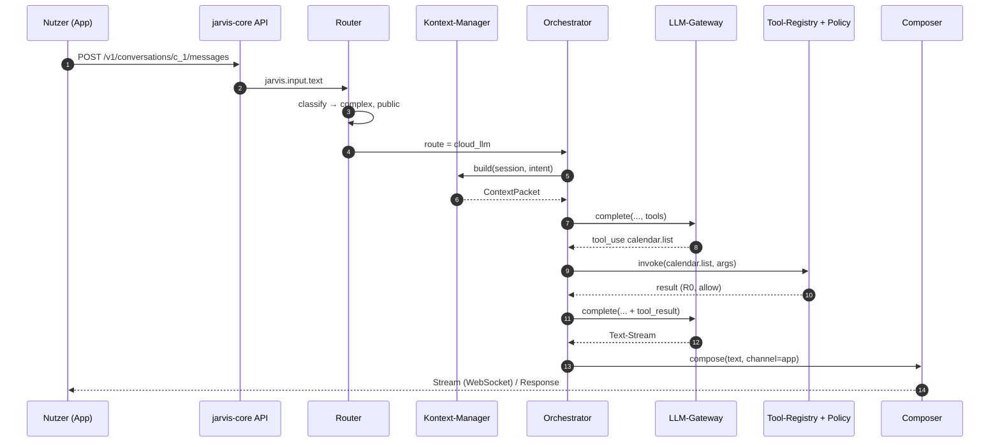
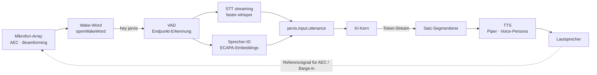
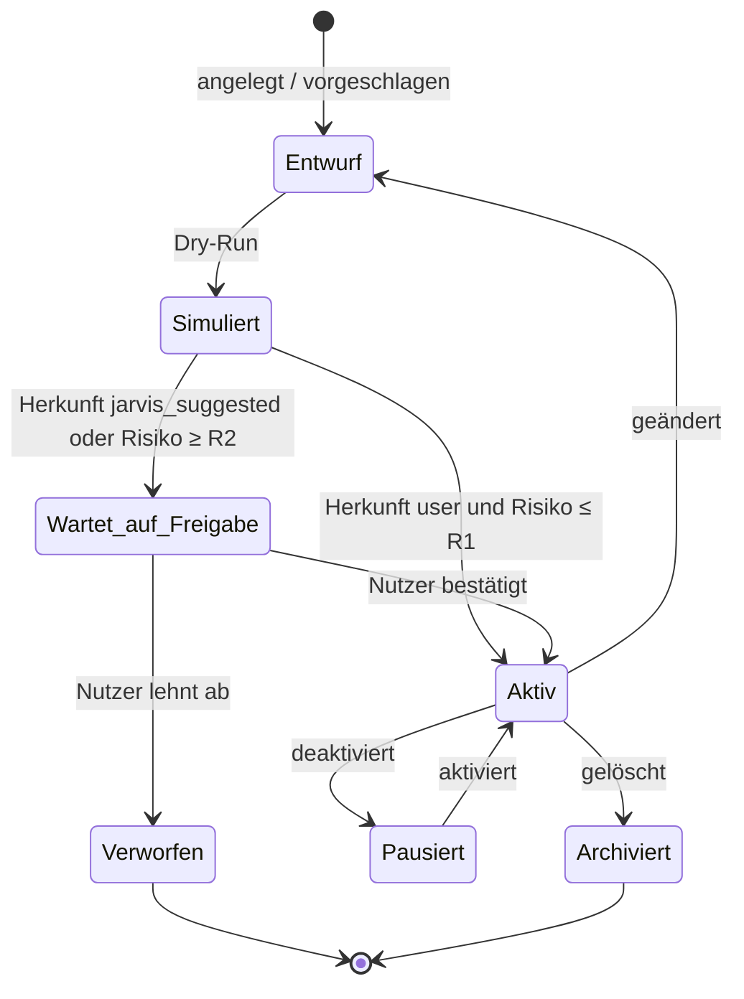
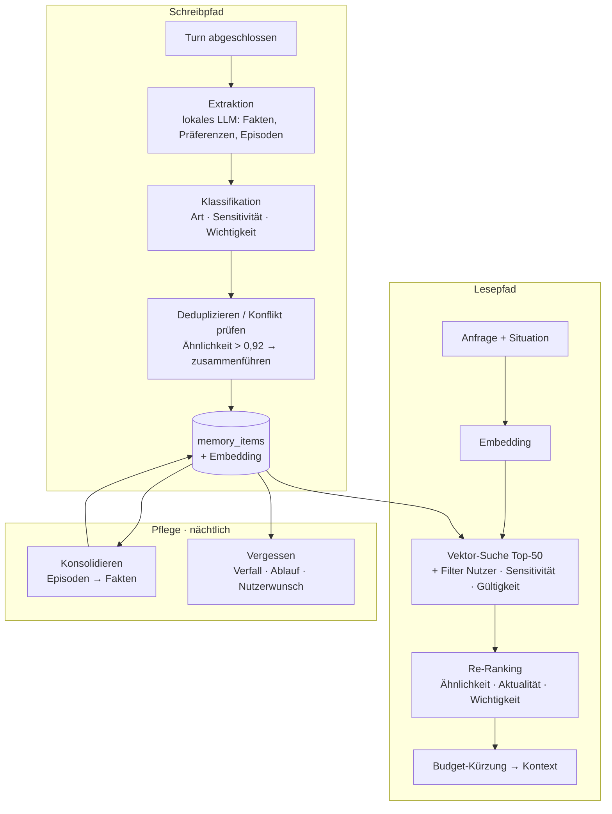
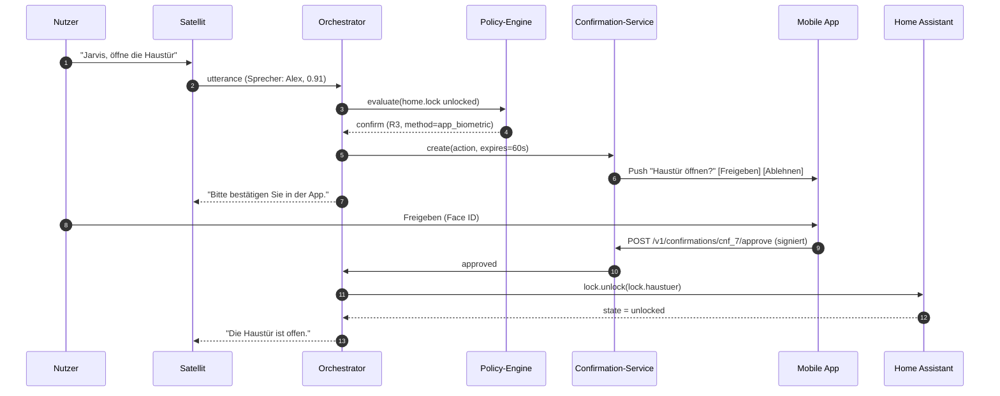

# 3. Module & Funktionen

[← Architektur](02-architektur.md) · [Übersicht](../README.md) · [Weiter: Technische Umsetzung →](04-technische-umsetzung.md)

Teil 3.1 definiert **was** JARVIS kann (Funktionsumfang mit Capability-IDs und Risikoklassen), Teil 3.2 **wie** die
Module aufgebaut sind (Komponenten, Schnittstellen, Datenfluss).

---

## 3.1 Funktionsumfang

Legende: **Risiko** = Risikoklasse laut [2.7.1](02-architektur.md#271-risikoklassen) · **Offline** = ohne Internet
verfügbar · Capability-IDs sind die kanonischen Namen in Tool-Registry, Policies und Audit-Log (im LLM-Tool-Namen wird
`.` durch `__` ersetzt, z. B. `home__set_light`, da Tool-Namen nur `[a-zA-Z0-9_-]` erlauben).

### 3.1.1 Allgemein

| Funktion | Beschreibung | Capability | Risiko | Offline |
|----------|--------------|-----------|--------|---------|
| Analyse | Texte, Tabellen, Dokumente (PDF, Bilder) analysieren; Vergleiche, Pro/Contra, Entscheidungsmatrizen | LLM + `files.read` | R0 | eingeschränkt (lokales LLM) |
| Recherche | Mehrquellen-Recherche mit Quellenangaben, Widerspruchsprüfung, Aktualitätsprüfung | `web.search`, `web.fetch` | R0 | nein |
| Zusammenfassung | Gespräche, Mails, Artikel, Meetings, Tagesrückblick („Was ist heute passiert?“) | LLM, `mail.search`, `events.query` | R0 | ja (lokal) |
| Kontext-Speicherung | Fakten, Präferenzen, Episoden merken, abrufen, korrigieren, vergessen | `memory.remember`, `memory.search`, `memory.forget` | R1 / R0 / R2 | ja |
| Multi-Step-Reasoning | Pläne erstellen und schrittweise ausführen, Zwischenstände speichern, bei Hürden nachfragen | Orchestrator + `task.plan` | je Schritt | teilweise |
| Proaktive Vorschläge | Hinweise aus Kalender, Wetter, Verkehr, Gerätezuständen, Mustern, Anomalien | Proaktiv-Engine | R0 (Hinweis) | teilweise |
| Rechnen & Umrechnen | Einheiten, Währungen, Rezepte skalieren, Datumsrechnung | lokal (deterministisch) + `info.fx` | R0 | ja (außer Kurse) |
| Übersetzen | Text und Gesprächsdolmetschen | LLM | R0 | ja (lokal, eingeschränkt) |

### 3.1.2 Smart Home

| Funktion | Beschreibung | Capability | Risiko | Offline |
|----------|--------------|-----------|--------|---------|
| Licht | an/aus, Helligkeit, Farbe/Farbtemperatur, Raum/Zone/Alle, Übergänge | `home.set_light` | R1 | ja |
| Steckdosen & Schalter | schalten, Verbrauch abfragen, Zeitschaltung | `home.set_switch` | R1 (R2 für als `critical` markierte Verbraucher) | ja |
| Heizung | Soll-Temperatur, Modus, Zeitprogramme, Fenster-offen-Logik | `home.set_climate` | R2 | ja |
| Klima | Kühlen/Heizen/Lüften, Luftfeuchte, Luftqualität (CO₂) reagieren | `home.set_climate` | R2 | ja |
| Rollläden/Jalousien | Position, Lamellen, Beschattung nach Sonne/Wetter | `home.set_cover` | R1 | ja |
| Musik & Medien | Wiedergabe, Lautstärke, Quelle, Multiroom, „spiel etwas Ruhiges“ | `home.media_control`, `media.search` | R1 | teilweise |
| Kamera | Schnappschuss, Live-Ansicht in App, Ereignisse (Person/Paket) erklären – nur lokal verarbeitet | `home.camera_snapshot`, `vision.describe_local` | R2 | ja |
| Sicherheit | Schloss, Alarmanlage, Rauch-/Wassermelder-Status | `home.lock`, `home.alarm` | R1 (verriegeln/scharf) · R3 (öffnen/unscharf) | ja |
| Routinen & Szenen | „Guten Morgen“, „Filmabend“, „Ich gehe“ – Szenen aktivieren, Routinen ausführen | `home.activate_scene`, `automation.run` | R1 | ja |
| Automationen | per Sprache anlegen/ändern („Wenn ich nach 22 Uhr heimkomme, nur gedimmtes Licht“) | `automation.create`, `automation.update` | R2 | ja |
| Status-Monitoring | „Ist alles zu?“, offene Fenster, Batteriestände, Geräte offline, Energieverbrauch | `home.get_state`, `home.report` | R0 | ja |
| Durchsagen | Ansage in Räumen, Intercom zwischen Satelliten | `home.announce` | R1 | ja |
| Energie | Verbrauch, PV-Ertrag, günstige Zeitfenster für Geräte | `energy.report`, `energy.schedule_load` | R0 / R2 | teilweise |

### 3.1.3 Internet & Daten

| Funktion | Beschreibung | Capability | Risiko | Offline |
|----------|--------------|-----------|--------|---------|
| Web-Scraping | Seiten abrufen, Hauptinhalt extrahieren, JS-Rendering bei Bedarf, `robots.txt` respektieren, Ergebnis als *untrusted* markiert | `web.fetch` | R0 | nein |
| Websuche | über selbst gehostetes SearXNG, Ergebnis-Ranking, Dedup | `web.search` | R0 | nein |
| API-Abfragen | generischer HTTP-Client für freigegebene APIs (Allowlist), Antwort gegen Schema | `http.request` | R0 (GET) · R2 (schreibend) | nein |
| Nachrichten | personalisierter Nachrichtenüberblick aus RSS/APIs, Zusammenfassung, Themenfilter | `info.news` | R0 | nein |
| Wetter | aktuell, Vorhersage, Warnungen, Regenradar-Hinweise | `info.weather` | R0 | nein (Cache 1 h) |
| Nachschlagen | Fakten zu Personen, Orten, Begriffen aus Wikipedia; Ergebnis als *untrusted* markiert | `info.wikipedia` | R0 | nein |
| Verkehr | Fahrzeit mit Verkehr, ÖPNV-Verbindungen, Störungen | `info.traffic` | R0 | nein |
| Kalender | lesen, anlegen, verschieben, Konflikte erkennen, Einladungen (CalDAV, Google, Microsoft 365) | `calendar.list`, `calendar.create_event`, `calendar.update_event` | R0 / R2 | Cache |
| Aufgaben | To-dos, Projekte, Einkaufsliste, Fälligkeiten, Delegation an Haushaltsmitglieder | `task.create`, `task.update`, `task.list` | R1 / R0 | ja |
| Erinnerungen & Timer | zeit- und ortsbasiert („wenn ich nach Hause komme“), wiederkehrend | `reminder.create`, `timer.start` | R1 | ja |

### 3.1.4 Kommunikation

| Funktion | Beschreibung | Capability | Risiko | Offline |
|----------|--------------|-----------|--------|---------|
| E-Mails lesen | Posteingang priorisieren, zusammenfassen, Aktionen extrahieren (Inhalt = *untrusted*) | `mail.search`, `mail.read` | R0 | nein |
| E-Mails schreiben | Entwurf im Stil des Nutzers, Antwortvorschläge, Nachfassen | `mail.draft` | R1 | ja (Entwurf) |
| E-Mails senden | an bekannte Kontakte R2, an neue Empfänger/mit Anhängen aus Dateisystem R3 | `mail.send` | R2 / R3 | nein |
| Nachrichten | Messenger senden/lesen (Signal, Telegram, Matrix, SMS-Gateway) | `message.send`, `message.read` | R2 / R0 | nein |
| Telefon-Simulation | **Anruf-Modus:** Vollduplex-Sprachdialog mit Barge-in (App/WebRTC oder SIP über Asterisk). **Simulationsmodus:** JARVIS spielt ein Gegenüber (Bewerbungsgespräch, Kundenhotline, Arzttermin üben) oder simuliert einen Anruf zum Testen von Dialogen | `call.start`, `call.simulate` | R2 / R1 | teilweise |
| Gesprächsführung | Dialogzustand, Rückfragen bei Mehrdeutigkeit, Themenwechsel, Mehrpersonen-Erkennung, Unterbrechen (Barge-in), Folgefragen ohne Wake-Word (5 s Nachlauf) | Orchestrator + Voice | – | ja |
| Kontakte | nachschlagen, Beziehungen („meine Schwester“) auflösen | `contacts.search` | R0 | Cache |

### 3.1.5 Technik

| Funktion | Beschreibung | Capability | Risiko | Offline |
|----------|--------------|-----------|--------|---------|
| Code-Generierung | Code in allen gängigen Sprachen, Erklärung, Refactoring, Tests | LLM (Cloud bevorzugt) | R0 | eingeschränkt |
| Skripte | Shell/Python/PowerShell erzeugen; Ausführung **nur** in der Sandbox oder auf Host nach R3-Bestätigung | `code.run_sandbox`, `system.run_script` | R2 / R3 | ja |
| Systemdiagnosen | CPU/RAM/Disk/Temperaturen, Dienste, Container, Netzwerk, Backups, Zertifikatsabläufe | `system.diagnose` | R0 | ja |
| PC-Steuerung | Programme und Spiele aus dem Windows-Startmenü per Name starten, Ordner und Webseiten öffnen, im Web (Google, YouTube, Amazon …) und nach Dateien suchen – über den PC-Agenten (Allowlist + Startmenü, ausgehende Verbindung); natürliche Formulierungen als Sofortbefehle ohne LLM | `pc.open_app`, `pc.open_folder`, `pc.search_web`, `pc.search_files`, `pc.open_url` | R1 / R2 (URL) | ja |
| Fehleranalyse | Logs durchsuchen (Loki), Stacktraces erklären, Ursachen-Hypothesen, Korrelation mit Änderungen | `system.logs_query`, `system.diagnose` | R0 | ja |
| Optimierungsvorschläge | Ressourcen, Energie, Automationen, Netzwerk, Kosten – als Vorschlag mit Begründung und Rollback-Plan | Proaktiv-Engine + LLM | R0 | teilweise |
| Wartungsaktionen | Dienst neu starten, Container aktualisieren, Cache leeren | `system.service_restart`, `system.container_update` | R2 / R3 | ja |

---

## 3.2 Modul-Design

Jedes Modul hat eine klar definierte Schnittstelle: **bereitgestellte APIs**, **konsumierte/produzierte Events** und
**registrierte Capabilities**. Module kommunizieren ausschließlich über den Event-Bus, interne gRPC/HTTP-Schnittstellen
oder die Tool-Registry – nie über gemeinsame Datenbanktabellen anderer Module.

### 3.2.1 Core-AI-Module

**Zweck:** Verstehen, Planen, Entscheiden, Antworten.

| Komponente | Aufgabe | Schnittstelle |
|------------|---------|---------------|
| Intent-Klassifikator | Intent, Slots, Sensitivität, Komplexität bestimmen | `classify(text, ctx) → Intent` ([Schema](../schemas/intent.schema.json)) |
| Fast-Path-NLU | Grammatiken (z. B. hassil-kompatibel) für Top-50-Befehle, Slot-Auflösung gegen Entitätsregister | `match(text) → Intent?` |
| Router | Route wählen (Tabelle 2.3.2) | `route(intent, ctx) → Route` |
| Orchestrator | Agent-Loop, Tool-Aufrufe, Taint-Tracking, Verifikation | `handle_turn(event) → TurnResult` |
| Kontext-Manager | Kontextpaket mit Token-Budget bauen, Verlauf zusammenfassen | `build(session, intent) → ContextPacket` |
| LLM-Gateway | Provider-Adapter (Claude, Ollama), Streaming, Retries, Circuit-Breaker, Kosten-/Token-Tracking | `complete(system, messages, tools, on_text) → LLMResponse` |
| Response-Composer | Inhalt + Persona + Kanal → Ausgabe | `compose(content, channel, persona) → Output` |
| Proaktiv-Engine | Kandidaten generieren, bewerten, zustellen, Feedback lernen | konsumiert Events, produziert `jarvis.proactive.suggestion` |

**Datenfluss (Textanfrage):**

**Konfiguration:** `config/jarvis.example.yaml` → `core.*`, `llm.*`, `router.*`.
**Fehlerverhalten:** LLM-Fehler → Fallback-Provider; Tool-Fehler → strukturiertes Fehler-Tool-Result; Timeout →
Teilergebnis + ehrlicher Hinweis.

### 3.2.2 Voice-Module (STT, TTS, Voice-Persona)

**Zweck:** Natürliche, latenzarme Sprachinteraktion mit Sprechererkennung.

| Komponente | Umsetzung | Kennzahl |
|------------|-----------|----------|
| Wake-Word | openWakeWord-Modell „hey_jarvis“ auf dem Satelliten, serverseitige Zweitprüfung | Schwelle 0,5; Zweitprüfung 0,7 |
| VAD / Endpointing | Silero-/WebRTC-VAD; Ende nach 700 ms Stille (adaptiv: kürzer bei Befehlen) | – |
| STT | faster-whisper `large-v3-turbo` (GPU) bzw. `small` (CPU), Sprache `de`/`en`, Wortliste aus Entitätsnamen als Prompt | RTF < 0,2 |
| Sprecher-ID | Enrollment mit 5 Sätzen pro Person; Cosinus-Ähnlichkeit ≥ 0,75 = erkannt | Konfidenz → Trust |
| TTS | Piper (lokal, `de_DE`/`en_GB`-Stimmen), SSML-Light (Pausen, Betonung), Satz-Streaming | erster Chunk < 300 ms |
| Barge-in | Nutzer spricht während TTS → TTS stoppt, neue Äußerung wird verarbeitet | < 200 ms |
| Folgefragen | 5 s Nachlauf ohne Wake-Word nach einer Rückfrage | – |
| Voice-Persona | Stimme, Sprechtempo, Tonhöhe, Pausen pro Persona ([Abschnitt 7](07-jarvis-persona.md)) | – |

**Schnittstellen:** Wyoming-Protokoll (Satelliten, Whisper, Piper, openWakeWord), WebSocket `/v1/stream` (App/Browser),
MQTT `jarvis/v1/satellite/{id}/…` (Status, LEDs, Lautstärke).

### 3.2.3 Smart-Home-Connector (Home Assistant, MQTT, REST, Webhooks)

**Zweck:** Einheitliche Geräteschicht; JARVIS spricht „Capabilities“, der Connector übersetzt in Systembefehle.

| Komponente | Aufgabe |
|------------|---------|
| HA-Client | WebSocket-API: Auth, `get_states`, `subscribe_events(state_changed)`, `call_service`, Registry-Abfragen (Areas, Devices, Entities) |
| Entity-Registry-Sync | spiegelt Entitäten, Räume, Aliase („Deckenlampe“ → `light.wohnzimmer_decke`) in `home_entities` |
| State-Cache | aktueller Zustand aller Entitäten in Redis (für Kontext & Bedingungen), Änderungen → Event-Bus |
| MQTT-Bridge | direkte Geräte/Satelliten, Topic-Schema `jarvis/v1/…`, Home-Assistant-MQTT-Discovery für JARVIS-eigene Entitäten |
| REST-Adapter | generische Geräte-APIs (z. B. Wallbox, Wechselrichter) per deklarativer Mapping-Datei |
| Webhook-Adapter | eingehende Geräte-Webhooks (Türklingel) → Events; ausgehende Webhooks zu Diensten |

**Capability-Mapping (Auszug):**

| Capability | Parameter | Home-Assistant-Service | Verifikation |
|-----------|-----------|------------------------|--------------|
| `home.set_light` | `entity_ids`, `on`, `brightness_pct`, `color_temp_kelvin`, `rgb_color`, `transition` | `light.turn_on` / `light.turn_off` | `state == on/off`, Helligkeit ±5 % |
| `home.set_switch` | `entity_ids`, `on` | `switch.turn_on` / `switch.turn_off` | `state` |
| `home.set_climate` | `entity_id`, `temperature`, `hvac_mode` | `climate.set_temperature`, `climate.set_hvac_mode` | Attribut `temperature` |
| `home.set_cover` | `entity_ids`, `position` | `cover.set_cover_position` | Attribut `current_position` (nach Laufzeit) |
| `home.media_control` | `entity_id`, `command`, `volume`, `media` | `media_player.*` | `state` |
| `home.activate_scene` | `scene_id` | `scene.turn_on` | – |
| `home.lock` | `entity_id`, `state: locked/unlocked` | `lock.lock` / `lock.unlock` | `state` |
| `home.alarm` | `entity_id`, `state: armed_home/armed_away/disarmed`, `code_ref` | `alarm_control_panel.alarm_*` | `state` |

**Auflösung von Zielen:** Nutzer nennt Raum/Alias → Registry-Lookup → bei mehreren Treffern Rückfrage
(„Meinen Sie die Deckenlampe oder die Stehlampe?“). Standardraum = Raum des Satelliten.

### 3.2.4 Automation-Engine

**Zweck:** Deterministische, nachvollziehbare Abläufe – von Nutzern oder von JARVIS vorgeschlagen.

| Komponente | Aufgabe |
|------------|---------|
| Rule-Store | Automationen (Schema-validiert), Versionierung, Herkunft, Freigabestatus |
| Trigger-Matcher | abonniert Events, prüft Trigger (State, Event, Zeit, Cron, Sonne, Anwesenheit, Webhook) |
| Condition-Evaluator | wertet Bedingungsbäume gegen State-Cache aus (rein, testbar) |
| Action-Runner | führt Aktionen sequenziell aus; jede Capability läuft durch die Policy-Engine mit Actor `automation:<id>` |
| Scheduler | Zeit-/Cron-Trigger, Timer, Erinnerungen (persistiert, überlebt Neustarts) |
| Suggestion-Miner | erkennt wiederkehrende manuelle Handlungen („jeden Werktag 6:45 Kaffeemaschine an“) → Vorschlag |
| Simulator | Dry-Run gegen Event-Historie, Konflikterkennung (zwei Regeln steuern dasselbe Gerät gegensätzlich) |

**Lebenszyklus einer Automation:**

**Ausführungsmodi** (pro Automation): `single` (läuft nicht doppelt), `restart`, `queued`, `parallel` – kompatibel zu
Home-Assistant-Semantik. Jeder Lauf erzeugt einen `automation_runs`-Eintrag mit Trace (welcher Trigger, welche
Bedingung wahr/falsch, welche Aktion mit welchem Ergebnis).

**Abgrenzung zu Home Assistant:** Rein gerätelokale, latenzkritische Automationen (Bewegungsmelder → Licht) bleiben in
HA. JARVIS-Automationen sind für geräteübergreifende, kontext- oder LLM-gestützte Abläufe gedacht; JARVIS kann HA-
Automationen lesen, erklären und Vorschläge als HA-YAML exportieren.

### 3.2.5 Task-Manager

**Zweck:** Alles, was Zeit, Zustand oder mehrere Schritte hat.

| Task-Typ | Beispiel | Besonderheit |
|----------|----------|--------------|
| `todo` | „Setz Milch auf die Einkaufsliste“ | Listen, Zuweisung an Personen, Sync mit externen To-do-Apps |
| `reminder` | „Erinnere mich morgen um 8 an den Zahnarzt“ | Zeit-, Orts- (Geofence) oder Ereignis-Trigger |
| `timer` | „Timer 12 Minuten Nudeln“ | an Satellit/Raum gebunden, Ansage bei Ablauf |
| `job` | „Recherchiere E-Autos unter 40 k€ und fasse zusammen“ | Hintergrund-Agent mit Budget (Tokens, Zeit), Fortschritt, Ergebnis als Nachricht |
| `plan` | „Organisiere den Geburtstag“ | Schritte mit Abhängigkeiten (DAG), Freigaben je Schritt, fortsetzbar |

Zustände: `pending → scheduled → running → (waiting_confirmation) → done | failed | cancelled`. Fehlgeschlagene Jobs
werden mit exponentiellem Backoff (max. 3 Versuche) wiederholt, sofern der Fehler `retryable` ist
(siehe [4.6](04-technische-umsetzung.md#46-error-handling)).

**Schnittstellen:** REST `/v1/tasks`, Capabilities `task.*`, `reminder.create`, `timer.start`, Events
`jarvis.task.due`, `jarvis.task.completed`.

### 3.2.6 Memory-System

**Zweck:** JARVIS erinnert sich wie ein guter Assistent: relevant, korrigierbar, datensparsam.

**Ranking:** `score = 0,6 · ähnlichkeit + 0,25 · aktualität + 0,15 · wichtigkeit`, mit
`aktualität = 0,5^(alter_tage / 30)` (Halbwertszeit 30 Tage; für semantische Fakten ohne Verfall = 1).

**Regeln:**

- **Explizit schlägt implizit:** „Merk dir …“ → Wichtigkeit 0,9, Konfidenz 1,0. Abgeleitete Präferenzen starten bei
  Konfidenz 0,6 und steigen mit Bestätigung.
- **Widersprüche:** Neuer Fakt mit gleichem Subjekt/Prädikat beendet den alten (`valid_until`), statt ihn zu löschen –
  Historie bleibt nachvollziehbar.
- **Sensitivität:** `secret` wird nie gespeichert (Passwörter, PINs), sondern auf den Vault verwiesen; `sensitive`
  nur lokal verarbeitet und nie in Cloud-Prompts.
- **Nutzerkontrolle:** „Was weißt du über mich?“, „Vergiss das“, Export (JSON) und vollständige Löschung pro Nutzer
  (DSGVO Art. 15/17/20).
- **Haushaltsgrenzen:** Persönliche Erinnerungen sind nur für die jeweilige Person sichtbar; Haushaltswissen
  (`user_id = NULL`) für alle Mitglieder.

**Schnittstellen:** Capabilities `memory.search`, `memory.remember`, `memory.forget`; REST `/v1/memory`; Event
`jarvis.memory.updated`.

### 3.2.7 Security-Module

| Komponente | Aufgabe | Technik |
|------------|---------|---------|
| Authentifizierung | Nutzer (OIDC), Geräte (mTLS-Zertifikate / Geräte-Token), Stimme (Sprecher-ID), Dienste (mTLS) | Authelia/Keycloak, step-ca |
| Policy-Engine | RBAC + ABAC + Risikoklassen → `allow`/`confirm`/`deny` | deterministischer Evaluator, Regeln in YAML ([`config/policies.yaml`](../config/policies.yaml)) |
| Confirmation-Service | Bestätigungen anlegen, zustellen (Sprache, App-Push mit Biometrie, PIN), Ablauf (60 s), auflösen | Redis + Push |
| Audit-Log | jede Entscheidung und Aktion, hash-verkettet, append-only | Postgres-Tabelle mit Insert-only-Rolle |
| Secrets-Vault | API-Schlüssel, Tokens, Alarmcodes; Zugriff nur per Referenz und Berechtigung | Vault / SOPS |
| Sandbox | Code-Ausführung ohne Netz, CPU/RAM/Zeit-Limits, Read-only-Root | gVisor/Firecracker oder rootless Docker mit seccomp |
| Rate-Limiter | pro Nutzer, Quelle, Capability | Token-Bucket in Redis |
| Redaktion | PII/Secrets aus Logs und Cloud-Prompts entfernen | Regex + NER lokal + Vault-Hash-Abgleich |

**Bestätigungsablauf (R3):**

### 3.2.8 Plugin-System

**Zweck:** Neue Fähigkeiten ohne Kernänderung, sicher isoliert.

**Manifest** ([Schema](../schemas/plugin-manifest.schema.json), [Beispiel](../reference/node/plugin-weather/plugin.json)):
ID, Version, Laufzeit, Einstiegspunkt, Capabilities (Name, Beschreibung, `input_schema`, Risikoklasse,
Seiteneffekte, Timeout), Event-Abos, Berechtigungen (Netz-Hosts, Dateipfade, Secrets, Entitätsmuster, Memory-Zugriff),
Konfigurationsschema, Signatur.

**Plugin-Protokoll (HTTP/JSON, Laufzeiten `python`/`node`/`container`):**

| Endpunkt | Richtung | Inhalt |
|----------|----------|--------|
| `GET /manifest` | Host → Plugin | Manifest (muss mit installiertem, signiertem Manifest übereinstimmen) |
| `GET /health` | Host → Plugin | `{"status":"ok"}` |
| `POST /invoke` | Host → Plugin | `{"capability","arguments","context":{"correlation_id","actor","locale"},"deadline_ms"}` → `{"ok":true,"result":…}` oder `{"ok":false,"error":{Problem Details}}` |
| `POST /events` | Host → Plugin | abonnierte Events (CloudEvents) |
| `POST /v1/events` (Kern-API) | Plugin → Kern | eigene Events publizieren (nur deklarierte Typen) |

**MCP-Plugins:** Laufzeit `mcp` bindet einen Model-Context-Protocol-Server ein (stdio oder HTTP). Der Plugin-Host
liest dessen Tool-Liste, gleicht sie mit dem Manifest ab (nur deklarierte Tools werden registriert) und ergänzt
Risikoklasse und Berechtigungen aus dem Manifest. Dadurch ist das gesamte MCP-Ökosystem nutzbar, ohne die
Sicherheitsgarantien aufzugeben.

**Versionierung:** SemVer; `jarvis_api`-Feld deklariert kompatible Kern-Versionen; bei Update mit erweiterten
Berechtigungen ist eine erneute Admin-Freigabe nötig.

**Kern-Plugins** (mitgeliefert, gleiche Mechanik): `web` (Suche/Fetch), `info` (Wetter, News, Verkehr), `pim`
(Kalender, Kontakte, Aufgaben-Sync), `comms` (Mail, Messenger, Anrufe), `devops` (Diagnose, Logs, Container),
`sandbox` (Code-Ausführung), `energy`.
