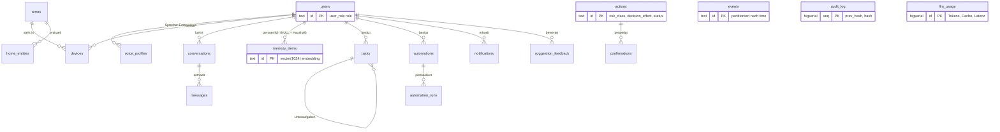
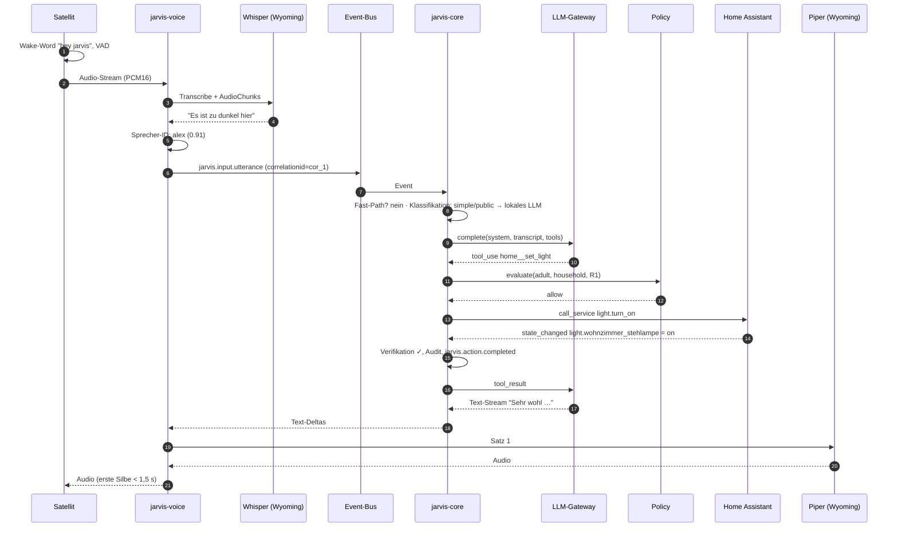
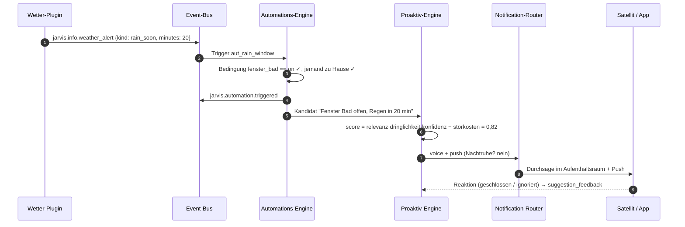
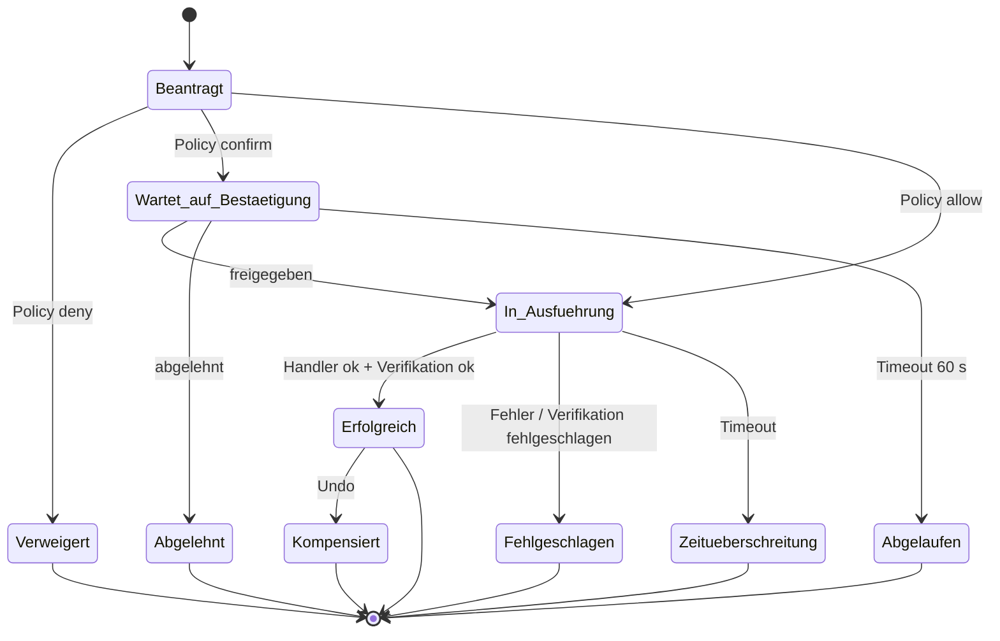

# 4. Technische Umsetzung

[← Module & Funktionen](03-module-und-funktionen.md) · [Übersicht](../README.md) · [Weiter: Code-Beispiele →](05-code-beispiele.md)

## 4.1 Projektstruktur der Implementierung

Das Referenz-Skelett in [`reference/python`](../reference/python) bildet den Kern ab. Für die vollständige
Implementierung wird es in folgende Pakete/Dienste aufgeteilt (Monorepo):

```
services/
  core/          FastAPI-App, Router, Orchestrator, Kontext, Composer      (heute: jarvis.api/app/orchestrator/context)
  voice/         Audio-Sessions, Wyoming-Clients, Sprecher-ID, Satz-Streaming (heute: jarvis.voice)
  worker/        Automationen, Scheduler, Task-Manager, Proaktiv-Engine    (heute: jarvis.automation)
  connectors/    Home Assistant, MQTT, Mail, Kalender, Messenger           (heute: jarvis.connectors)
  plugin-host/   Start/Isolation von Plugins, MCP-Clients
libs/
  jarvis-common/ Events, Fehler, Logging, Policy, Tool-Registry, LLM-Gateway (heute: jarvis.events/errors/…)
schemas/         JSON-Schemas = Vertrag zwischen allen Diensten
api/openapi.yaml REST-Vertrag
db/migrations/   versionierte Migrationen (Ausgangspunkt: db/schema.sql)
```

Konventionen: Python 3.12, `asyncio` durchgehend, Pydantic-Modelle an Dienstgrenzen, jede externe Nachricht wird
gegen ihr JSON-Schema validiert, IDs mit Präfix (`evt_`, `act_`, `cnf_`, `mem_`, `aut_`, `tsk_`), alle Zeiten UTC
(`timestamptz`), lokale Zeit nur für Bedingungen/Anzeige.

## 4.2 API-Blueprints

### 4.2.1 REST-Endpunkte

Vollständige Spezifikation: [`api/openapi.yaml`](../api/openapi.yaml) (OpenAPI 3.1, referenziert die JSON-Schemas).
✔ = im Referenzcode implementiert und getestet.

| Methode & Pfad | Zweck | Auth | Referenz |
|----------------|-------|------|----------|
| `POST /v1/conversations/{id}/messages` | Text-Turn, Antwort + Aktionen | Bearer | ✔ |
| `WS /v1/stream` | Streaming: Text-Deltas, Bestätigungen, Audio | Token (Query) | ✔ (Text) |
| `POST /v1/events` | CloudEvent einspeisen (Trust aus Token) | Bearer | ✔ |
| `POST /v1/webhooks/{hook_id}` | signierter Webhook → `jarvis.webhook.received` | HMAC | ✔ |
| `POST /v1/confirmations/{id}` | Bestätigung freigeben/ablehnen | Bearer | ✔ |
| `GET /v1/system/health` | Zustand, Circuit-Breaker | – | ✔ |
| `POST /v1/actions` · `GET /v1/actions/{id}` | Capability direkt ausführen / Status | Bearer | Blueprint |
| `GET/POST /v1/automations` · `POST …:dry-run` | Automationen verwalten, simulieren | Bearer | Blueprint |
| `GET/POST /v1/tasks` | To-dos, Erinnerungen, Timer, Jobs | Bearer | Blueprint |
| `GET /v1/memory` · `DELETE /v1/memory/{id}` · `GET /v1/memory/export` | Gedächtnis einsehen, löschen, exportieren | Bearer | Blueprint |
| `GET/POST /v1/plugins` | Plugins auflisten/installieren | Bearer (Admin) | Blueprint |
| `GET/PUT /v1/persona` | Persona lesen/wechseln | Bearer | Blueprint |

### 4.2.2 Beispiel-Requests und -Responses

**Text-Turn mit Tool-Aufruf**

```http
POST /v1/conversations/c_812/messages HTTP/1.1
Authorization: Bearer eyJhbGciOi…
Content-Type: application/json

{"text": "Mach es im Wohnzimmer etwas gemütlicher", "channel": "app"}
```

```json
{
  "text": "Sehr wohl. Stehlampe auf 40 Prozent, warmweiß.",
  "route": "llm:ollama",
  "stop_reason": "end_turn",
  "tainted": false,
  "actions": [
    {
      "action_id": "act_5c1e0a9b2f7d4e6a8b3c1d2e",
      "capability": "home.set_light",
      "status": "succeeded",
      "decision": {"effect": "allow", "risk_class": "R1", "reason": "Innerhalb der Berechtigungen",
                   "rule_id": "role.adult.default", "method": "none"},
      "result": {"entity_ids": ["light.wohnzimmer_stehlampe"], "previous": {"light.wohnzimmer_stehlampe": {"state": "off", "brightness": null}}},
      "verification": {"verified": true, "expected": {"state": "on"}, "observed": {"light.wohnzimmer_stehlampe": "on"}},
      "undo": {"capability": "home.set_light", "arguments": {"entity_ids": ["light.wohnzimmer_stehlampe"], "on": false}}
    }
  ]
}
```

**R3-Aktion → offene Bestätigung**

```json
{
  "text": "Selbstverständlich – bitte bestätigen Sie das Öffnen der Haustür in der App.",
  "route": "llm:claude",
  "stop_reason": "end_turn",
  "tainted": false,
  "actions": [{"action_id": "act_Q2w8Er5T", "capability": "home.lock", "status": "pending_confirmation",
               "decision": {"effect": "confirm", "risk_class": "R3", "reason": "R3 erfordert immer eine starke Bestätigung",
                            "rule_id": "risk.R3", "method": "app_biometric"}}],
  "pending_confirmation": {"confirmation_id": "cnf_7", "method": "app_biometric",
                           "prompt": "Verriegelt (locked) oder entriegelt (unlocked) ein Türschloss: {\"entity_id\": \"lock.haustuer\", \"state\": \"unlocked\"} – ausführen?",
                           "expires_at": "2026-09-26T19:44:10+00:00"}
}
```

```http
POST /v1/confirmations/cnf_7 HTTP/1.1
Authorization: Bearer <App-Token>
Content-Type: application/json

{"decision": "approve", "method": "app_biometric", "attestation": "<signierte Geräte-Challenge>"}
```

**Event einspeisen** (Trust/Actor setzt der Server aus dem Token):

```bash
curl -X POST https://jarvis.home.example/v1/events \
  -H "Authorization: Bearer $TOKEN" -H "Content-Type: application/cloudevents+json" \
  -d '{"specversion":"1.0","source":"/nodered/waschmaschine","type":"jarvis.home.appliance_finished",
       "subject":"switch.steckdose_waschmaschine","data":{"appliance":"waschmaschine"}}'
# -> 202 {"accepted":"evt_4be1…"}
```

**Fehlerantwort** (RFC 9457, [`error.schema.json`](../schemas/error.schema.json)):

```json
{
  "type": "https://docs.jarvis.local/errors/jrv-auth-001",
  "title": "Nicht authentifiziert",
  "status": 401,
  "detail": "Bearer-Token fehlt oder ist ungültig",
  "instance": "/v1/conversations/c1/messages",
  "code": "JRV-AUTH-001",
  "category": "auth",
  "retryable": false
}
```

### 4.2.3 WebSocket-Protokoll `/v1/stream`

JSON-Textframes für Steuerung, Binärframes für Audio (PCM16 LE, mono). Browser authentifizieren sich mit einem
kurzlebigen Token im Query-Parameter (≤ 60 s gültig, einmalig), da beim Handshake keine Header gesetzt werden können.

| Richtung | Typ | Felder | Bedeutung |
|----------|-----|--------|-----------|
| → | `input.text` | `text`, `session_id`, `channel` | Text-Turn |
| → | `audio.start` | `session_id`, `format{rate,width,channels}` | Äußerung beginnt; danach Binärframes (20 ms) |
| → | `audio.stop` | – | Ende der Äußerung (Push-to-Talk losgelassen / VAD) |
| → | `output.cancel` | – | Barge-in: laufende Ausgabe abbrechen |
| → | `confirmation.resolve` | `confirmation_id`, `decision`, `method` | Bestätigung aus der App |
| → | `ping` | – | Heartbeat (alle 25 s) |
| ← | `transcript.partial` / `transcript.final` | `text` | STT-Zwischen-/Endergebnis |
| ← | `output.text_delta` | `delta` | Token-Stream der Antwort |
| ← | `audio.format` + Binärframes | `rate` | TTS-Audio, satzweise |
| ← | `output.final` | `text`, `route`, `actions`, `pending_confirmation?` | Turn abgeschlossen |
| ← | `action.update` | `action` | Statusänderung einer Aktion |
| ← | `notification` | `title`, `body`, `priority` | proaktiver Hinweis |
| ← | `error` | `error` (Problem Details) | Fehler zu einer Nachricht; Verbindung bleibt offen |
| ← | `pong` | – | Heartbeat-Antwort |

Close-Codes: `4401` Authentifizierung fehlgeschlagen (kein Reconnect), `4408` Idle-Timeout, `1012` Server-Neustart
(Reconnect mit Backoff).

### 4.2.4 MQTT-Topics

Präfix `jarvis/v1`. QoS 1 für Kommandos und Events, QoS 0 für hochfrequente Sensorwerte; `retain` nur für Zustände.

| Topic | Richtung | Payload | QoS / Retain |
|-------|----------|---------|--------------|
| `jarvis/v1/status` | Kern → alle | `{"state":"online\|offline"}` (Last Will) | 1 / retain |
| `jarvis/v1/in/sensor/<quelle>/<sensor>` | Gerät → Kern | `{"value", "unit", "ts"}` → `jarvis.sensor.reading` | 0–1 |
| `jarvis/v1/cmd/<device_id>` | Kern → Gerät | `{"command", "request_id", …}` | 1 |
| `jarvis/v1/state/<device_id>/ack` | Gerät → Kern | `{"request_id", "ok"}` | 1 |
| `jarvis/v1/state/<device_id>/availability` | Gerät → alle | `online` / `offline` (Last Will) | 1 / retain |
| `jarvis/v1/satellite/<id>/status` | Satellit → Kern | `{"state":"idle\|listening\|speaking", "volume", "muted"}` | 1 / retain |
| `jarvis/v1/satellite/<id>/led` | Kern → Satellit | `{"pattern":"listening\|thinking\|error"}` | 0 |
| `jarvis/v1/event/<typ>` | Kern → Abonnenten | CloudEvent (z. B. `action.completed`) | 1 |
| `homeassistant/<komponente>/jarvis/<objekt>/config` | Kern → HA | MQTT-Discovery | 1 / retain |

Zugriffsrechte: [`integrations/mqtt/acl`](../integrations/mqtt/acl) – Geräte dürfen nur Topics mit ihrem eigenen
Benutzernamen (`%u`) nutzen.

### 4.2.5 Webhooks

**Eingehend** (`POST /v1/webhooks/{hook_id}`): HMAC-SHA256 über `"<timestamp>.<body>"` mit dem Secret des Hooks.

| Header | Inhalt | Prüfung |
|--------|--------|---------|
| `X-Jarvis-Timestamp` | Unix-Sekunden | ±300 s |
| `X-Jarvis-Signature` | `sha256=<hex>` | konstantzeitiger Vergleich |
| `X-Jarvis-Delivery` | eindeutige ID | Replay-Cache 10 min |

Das erzeugte Event hat immer Trust `external_untrusted` → es kann Automationen auslösen und Hinweise erzeugen, aber
über das LLM nie selbst Aktionen ≥ R1 anstoßen. Quellen ohne Signaturfähigkeit laufen über das
[Webhook-Relay](../reference/node/webhook-relay.mjs).

**Ausgehend** (JARVIS → Dienste): dieselbe Signatur, Retry mit exponentiellem Backoff (4 Versuche, nur bei 5xx/429),
Zustell-ID für Idempotenz beim Empfänger.

## 4.3 JSON-Schemas

Alle Schemas nutzen JSON Schema Draft 2020-12 und sind der verbindliche Vertrag zwischen Diensten, Plugins und Clients.
Beispiele unter [`schemas/examples`](../schemas/examples) werden in CI validiert.

| Schema | Beschreibung | Beispiele |
|--------|--------------|-----------|
| [`event.schema.json`](../schemas/event.schema.json) | CloudEvents-Umschlag + `correlationid`, `causationid`, `actor`, `trust`, `priority`; typabhängige `data`-Prüfung | Äußerung, Zustandsänderung, Aktion abgeschlossen, Vorschlag |
| [`intent.schema.json`](../schemas/intent.schema.json) | Klassifikation, Route, Sensitivität, erlaubte Domänen | Fast-Path, Cloud-Recherche |
| [`action.schema.json`](../schemas/action.schema.json) | Aktionsantrag inkl. Kontext und Bestätigung | Licht, Haustür |
| [`action-result.schema.json`](../schemas/action-result.schema.json) | Status, Policy-Entscheidung, Ergebnis, Verifikation, Undo | ausstehend, fehlgeschlagen |
| [`error.schema.json`](../schemas/error.schema.json) | RFC 9457 + Fehlercode, Kategorie, `retryable`, `user_message` | Policy verweigert |
| [`memory-item.schema.json`](../schemas/memory-item.schema.json) | Gedächtniseintrag mit Tripel, Sensitivität, Gültigkeit | Präferenz, Episode |
| [`automation.schema.json`](../schemas/automation.schema.json) | Trigger/Bedingungen/Aktionen (rekursiv) | Ankunft abends, Regenwarnung, Morgen-Digest |
| [`plugin-manifest.schema.json`](../schemas/plugin-manifest.schema.json) | Laufzeit, Capabilities, Berechtigungen, Signatur | [Wetter-Plugin](../reference/node/plugin-weather/plugin.json) |
| [`persona.schema.json`](../schemas/persona.schema.json) | Stil-, Lexikon-, Humor- und Stimmparameter | [Jarvis](../config/persona.jarvis.yaml), [neutral](../config/persona.neutral.yaml) |

Auszug – typabhängige Validierung im Event-Schema:

```json
"allOf": [
  { "if":   { "properties": { "type": { "const": "jarvis.input.utterance" } } },
    "then": { "properties": { "data": { "$ref": "#/$defs/UtteranceData" } } } },
  { "if":   { "properties": { "type": { "enum": ["jarvis.action.completed", "jarvis.action.failed"] } } },
    "then": { "properties": { "data": { "$ref": "action-result.schema.json" } } } }
]
```

## 4.4 Datenbank-Struktur

PostgreSQL 16 mit `pgvector` (Embeddings, HNSW-Index) und `pgcrypto` (Audit-Hash-Kette). DDL:
[`db/schema.sql`](../db/schema.sql) – gegen PostgreSQL 16 + pgvector getestet (Hash-Kette inkl. Manipulations-
erkennung, Vektor-Suche, Partitionierung, Unique-Constraints).



| Tabelle | Inhalt | Besonderheiten | Aufbewahrung |
|---------|--------|----------------|--------------|
| `users`, `voice_profiles`, `devices`, `areas` | Identitäten, Stimmen, Geräte, Räume | Sprecher-Embeddings 192-dim | bis Löschung |
| `home_entities` | Spiegel der HA-Registry | generierte Spalte `domain`, GIN-Index auf Aliasen | Sync |
| `conversations`, `messages` | Verläufe (anbieterneutral, JSONB) | `tainted`-Flag je Nachricht | 90 Tage, danach nur Zusammenfassung |
| `memory_items` | Langzeitgedächtnis | HNSW-Cosinus-Index; **ein gültiger Fakt je Subjekt/Prädikat** (`NULLS NOT DISTINCT`) | Verfall/Widerruf |
| `tasks`, `automations`, `automation_runs` | Aufgaben, Regeln, Läufe mit Trace | Abhängigkeiten als Array, Budget für Jobs | Runs 30 Tage |
| `actions`, `confirmations` | jede beantragte Aktion + Entscheidung | eindeutiger `idempotency_key` | 1 Jahr |
| `events` | Event-Store | monatliche Range-Partitionen, Drop statt Delete | 30–90 Tage je Typ |
| `plugins`, `webhooks` | Manifeste, freigegebene Rechte, Secret-Referenzen | Secrets nur als Vault-Referenz | – |
| `notifications`, `suggestion_feedback` | Hinweise und Nutzerreaktionen | Lernsignal der Proaktiv-Engine | 180 Tage |
| `llm_usage` | Token/Kosten/Latenz je Aufruf | Cache-Hit-Quote | 1 Jahr (aggregiert) |
| `audit_log` | alle Entscheidungen und Ausführungen | Trigger bildet SHA-256-Kette, `audit_log_verify()`, App-Rolle ohne UPDATE/DELETE | 2 Jahre, signierter Export |

## 4.5 Event-Flow

### 4.5.1 Event-Katalog (Auszug)

| Typ | Erzeuger | Konsumenten |
|-----|----------|-------------|
| `jarvis.input.utterance` / `jarvis.input.text` | Voice, Gateway | Router/Orchestrator |
| `jarvis.sensor.state_changed` / `jarvis.sensor.reading` | HA-Connector, MQTT-Bridge | Automationen, Proaktiv-Engine, State-Cache |
| `jarvis.presence.changed` | Präsenz-Fusion (HA `person`, BLE, WLAN) | Automationen, Kontext |
| `jarvis.schedule.fired` | Scheduler | Automationen, Task-Manager |
| `jarvis.webhook.received` | Webhook-Gateway | Automationen |
| `jarvis.confirmation.requested` | Orchestrator | Notification-Router, App |
| `jarvis.action.completed` / `jarvis.action.failed` | Orchestrator | Audit, MQTT-Fan-out, Memory (Beobachtung), Dashboard |
| `jarvis.automation.triggered` | Automations-Engine | Audit, Dashboard |
| `jarvis.task.due` / `jarvis.task.completed` | Task-Manager | Notification-Router |
| `jarvis.proactive.suggestion` | Proaktiv-Engine | Notification-Router, Composer |
| `jarvis.memory.updated` | Memory-Service | Kontext-Cache |
| `jarvis.system.alert` | Monitoring | Proaktiv-Engine, Admin |

### 4.5.2 Sprachbefehl Ende-zu-Ende



### 4.5.3 Proaktiver Hinweis



### 4.5.4 Lebenszyklus einer Aktion



## 4.6 Error-Handling

### 4.6.1 Fehlercodes

| Code | Kategorie | HTTP | retryable | Bedeutung | Nutzerformulierung (Beispiel) |
|------|-----------|------|-----------|-----------|-------------------------------|
| `JRV-VAL-001` | validation | 422 | nein | Eingabe verletzt Schema | „Das habe ich nicht ganz verstanden.“ |
| `JRV-VAL-002` | validation | 422 | nein | Tool-Eingabe ungültig/abgeschnitten | (intern, LLM korrigiert) |
| `JRV-AUTH-001` | auth | 401 | nein | nicht authentifiziert | „Bitte melden Sie sich erneut an.“ |
| `JRV-AUTH-002` | auth | 401 | nein | Webhook-Signatur/Replay | – |
| `JRV-POL-001` | policy | 403 | nein | Bestätigung abgelehnt/abgelaufen | „Die Freigabe ist abgelaufen.“ |
| `JRV-POL-002` | policy | 403 | nein | Policy verweigert | „Das darf ich im Gastmodus nicht.“ |
| `JRV-NFD-001` | not_found | 404 | nein | Gerät/Ressource unbekannt | „Dieses Gerät kenne ich nicht.“ |
| `JRV-CNF-001` | conflict | 409 | nein | Idempotenz-/Automationskonflikt | – |
| `JRV-DEV-001` | device | 503 | ja | Gerät nicht erreichbar | „Das Thermostat antwortet gerade nicht.“ |
| `JRV-DEV-002` | device | 502 | nein | Zielzustand nicht erreicht | „Die Lampe hat nicht reagiert.“ |
| `JRV-INT-001` | integration | 502 | ja | Integration fehlerhaft | „Der Kalender ist gerade nicht erreichbar.“ |
| `JRV-LLM-001` | llm | 503 | ja | Modell nicht verfügbar | (Fallback lokal) |
| `JRV-LLM-002` | llm | 422 | nein | Modell hat abgelehnt | „Dabei kann ich nicht helfen.“ |
| `JRV-LLM-003` | llm | 400 | nein | ungültige Modellanfrage/Zugangsdaten | – |
| `JRV-TMO-001` | timeout | 504 | ja | Zeitüberschreitung | „Das dauert zu lange; ich habe abgebrochen.“ |
| `JRV-RATE-001` | rate_limit | 429 | ja | Rate-Limit | – |
| `JRV-SYS-001` | internal | 500 | nein | interner Fehler | „Da ist bei mir etwas schiefgegangen.“ |

Implementierung: [`jarvis/errors.py`](../reference/python/src/jarvis/errors.py).

### 4.6.2 Strategien

| Strategie | Wo | Umsetzung |
|-----------|-----|-----------|
| **Validieren an jeder Grenze** | API, Bus, Tools, Plugins | JSON-Schema; ungültige Tool-Eingaben gehen als `is_error`-Tool-Result an das LLM zurück (eine Korrekturrunde) |
| **Retry mit Jitter** | Integrationen, Geräte, LLM | nur `retryable`-Fehler, max. 3 Versuche, `retry_after_ms` wird respektiert; LLM-SDK retryt 429/5xx zusätzlich selbst |
| **Circuit-Breaker** | Cloud-LLM, externe APIs | 5 Fehler / 30 s → offen, 60 s Cooldown, Probeaufruf (half-open) |
| **Fallback** | LLM | Cloud → lokal (Verlauf wird vorher zurückgerollt, damit kein halber Tool-Zyklus bleibt); serverseitiger Refusal-Fallback bei Claude |
| **Idempotenz** | Aktionen, Webhooks | `idempotency_key` (unique), Zustell-ID-Replay-Cache |
| **Verifikation & Kompensation** | Zustandsänderungen | Soll/Ist-Prüfung; Undo-Aktion für R1/R2 („Mach das rückgängig“) |
| **Keine halben Tool-Aufrufe** | Orchestrator | bei `max_tokens`/`refusal` werden Tool-Aufrufe nie ausgeführt; Timeout rollt den Verlauf zurück |
| **Ehrliche Kommunikation** | Composer | Fehler werden benannt („Die Lampe hat nicht reagiert“), nie als Erfolg gemeldet |
| **Dead-Letter** | Event-Bus | fehlgeschlagene Events → `jarvis:events:dead` mit Fehlerursache, Alarm ab Schwelle |

## 4.7 Logging-System

### 4.7.1 Strukturierte Logs

JSON-Zeilen auf stdout ([`logging_setup.py`](../reference/python/src/jarvis/logging_setup.py)), gesammelt von Loki:

```json
{"ts": "2026-09-26T19:42:05.301+00:00", "level": "INFO", "service": "jarvis-core", "logger": "jarvis.orchestrator",
 "msg": "action executed", "correlation_id": "cor_4b9e2d", "session_id": "s_7f3a", "actor": "user:alex",
 "capability": "home.set_light", "status": "succeeded", "duration_ms": 109, "trace_id": "4bf92f3577b34da6a3ce929d0e0e4736"}
```

| Feld | Pflicht | Zweck |
|------|---------|-------|
| `ts`, `level`, `service`, `logger`, `msg` | ja | Basis |
| `correlation_id` | ja (ab Eingang) | verbindet Logs, Events, Aktionen, Audit eines Vorgangs |
| `session_id`, `actor` | wenn vorhanden | Nutzerbezug (pseudonym) |
| `trace_id`, `span_id` | ja | Verknüpfung zu OpenTelemetry-Traces |
| `capability`, `status`, `error_code`, `duration_ms` | bei Aktionen | Auswertung |

**Level:** `DEBUG` (lokal, nie in Produktion mit Inhalten), `INFO` (Vorgänge), `WARNING` (degradierte Zustände,
Reconnects), `ERROR` (fehlgeschlagene Vorgänge), `CRITICAL` (Sicherheitsereignisse, Audit-Kettenbruch).

**Datenschutz:** Keine Rohtexte von Äußerungen in `INFO`-Logs (nur Längen/Intent), Redaktion von Tokens, Passwörtern,
PINs und API-Schlüsseln (Schlüssel- und Musterbasiert), Audio nie im Log.

### 4.7.2 Traces und Metriken (OpenTelemetry)

Spans: `turn` → `route` → `llm.complete` (Attribute: Provider, Modell, Tokens, Cache-Treffer, `stop_reason`) →
`tool.invoke` → `policy.evaluate` → `capability.execute` → `verify`. Sprach-Turns ergänzen `stt`, `tts.first_chunk`.

| Metrik | Typ | Alarm |
|--------|-----|-------|
| `jarvis_turn_latency_seconds{route}` | Histogramm | p95 Fast-Path > 0,5 s |
| `jarvis_voice_first_audio_seconds` | Histogramm | p95 > 1,5 s |
| `jarvis_actions_total{capability,status,risk}` | Counter | Fehlerquote > 5 % / 15 min |
| `jarvis_policy_decisions_total{effect,rule}` | Counter | Anstieg `deny` bei Taint (Injection-Versuche) |
| `jarvis_llm_tokens_total{provider,kind}` | Counter | Kostenbudget |
| `jarvis_llm_cache_read_ratio` | Gauge | < 50 % (Prompt-Präfix instabil) |
| `jarvis_circuit_state{target}` | Gauge | offen > 10 min |
| `jarvis_bus_lag_seconds{stream}` / `jarvis_dead_letters_total` | Gauge/Counter | Lag > 5 s |
| `jarvis_audit_chain_ok` | Gauge | ≠ 1 → CRITICAL |

### 4.7.3 Audit-Log

Getrennt von Betriebslogs, in PostgreSQL (`audit_log`): jede Policy-Entscheidung, Ausführung, Bestätigung,
Plugin-/Policy-Änderung, Login und Export. Ein Trigger verkettet jeden Eintrag per SHA-256 mit seinem Vorgänger;
`audit_log_verify()` liefert die erste manipulierte Sequenznummer. Nächtlicher Export signiert (Ed25519) auf
externes Medium. Die Anwendungsrolle darf nur `INSERT`.

## 4.8 LLM-Anbindung im Detail

| Aspekt | Cloud (Claude) | Lokal (Ollama) |
|--------|----------------|----------------|
| Modell | `claude-opus-5` | z. B. `qwen2.5:14b-instruct` (Hardware-abhängig, siehe 6.5) |
| Aufruf | offizielles `anthropic`-SDK, `client.beta.messages.stream(...)` | native `/api/chat` mit `stream: true` |
| Denken/Aufwand | `thinking: {type: "adaptive"}`, `output_config.effort`: `medium` (Dialog) / `high` (Recherche, Code) | – |
| Tools | JSON-Schema, `eager_input_streaming: true`; Eingaben werden im Orchestrator gegen das Schema geprüft, bei `max_tokens`/`refusal` nie ausgeführt | `tools` im Ollama-Format |
| Prompt-Caching | Breakpoint am statischen Systemprompt (deckt Tools + Regeln + Persona); volatile Situation/Memories dahinter; Tools deterministisch sortiert | KV-Cache des Servers |
| Robustheit | SDK-Retries, Circuit-Breaker, serverseitiger Refusal-Fallback (`fallbacks: "default"`, Beta-Header `server-side-fallback-2026-07-01`) | Health-Check, Timeout |
| Verlauf | Assistenten-Blöcke werden unverändert an denselben Anbieter zurückgegeben | aus neutralem Transkript gerendert |

Der Verlauf wird nur an Turn-Grenzen gekürzt (nie zwischen Tool-Aufruf und Ergebnis). Für Modelle, die Denk-Blöcke
an einen unveränderten Verlauf binden, wird statt Abschneiden die serverseitige Kompaktierung bzw. eine
Zusammenfassung *vor* Sitzungsbeginn genutzt, damit der bestehende Verlauf nur angehängt, nie editiert wird.

Die Tool-Schemas verzichten auf Kombinatoren auf oberster Ebene (`anyOf`, `if/then`), damit sie bei allen Anbietern
funktionieren; zusätzliche Regeln prüfen die Handler selbst.

## 4.9 Teststrategie

| Ebene | Inhalt | Status im Repo |
|-------|--------|----------------|
| Unit | Policy-Matrix, Tool-Validierung, Risiko-Regeln, Bedingungen, Ranking, Segmentierung, Signaturen | ✔ `reference/python/tests` (111 Tests) |
| Szenario | Orchestrator mit skriptbarem LLM und simuliertem Home Assistant: Fast-Path, Bestätigungen, Prompt-Injection, Gäste, Abbrüche | ✔ |
| Vertrag | Schemas, Beispiele, Plugin-Manifeste, OpenAPI-Referenzen, Node-RED-Verdrahtung | ✔ `tools/validate.py` |
| Datenbank | Schema-Import, Hash-Kette, Vektor-Suche | ✔ CI-Job mit `pgvector/pgvector:pg16` |
| Sprachqualität | Eval-Set (≥ 300 Äußerungen je Sprache) für Intent, Tool-Wahl, Rückfragen; Regressionsvergleich je Modell/Prompt-Änderung | geplant (Phase 2) |
| Sicherheit | Injection-Korpus (Web, Mail, Webhooks), Stimm-Replay, Fuzzing der Tool-Eingaben | teilweise (Taint-Tests) |
| Chaos | WAN aus, HA aus, Redis aus, LLM-Timeouts → degradierte Modi | geplant (Phase 3) |
