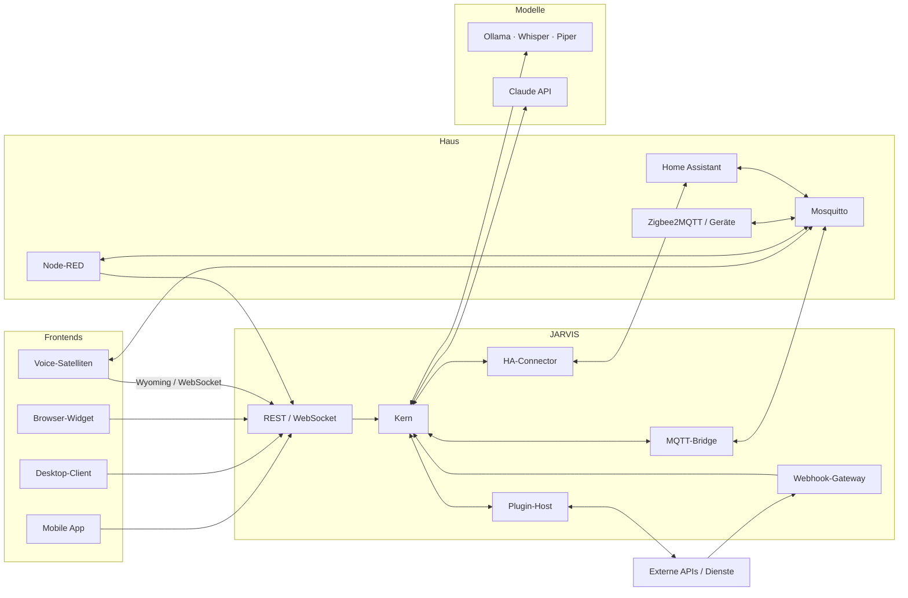

# 6. Integrationsplan

[← Code-Beispiele](05-code-beispiele.md) · [Übersicht](../README.md) · [Weiter: Jarvis-Persona →](07-jarvis-persona.md)



## 6.1 Home Assistant

Home Assistant ist die **Geräteschicht**: Es kennt Geräte, Räume und Zustände; JARVIS liefert Verständnis, Planung,
Gedächtnis und Sicherheit darüber.

| Aufgabe | Weg | Details |
|---------|-----|---------|
| Zustände lesen, Änderungen empfangen | WebSocket-API | `get_states`, `subscribe_events(state_changed)` → `jarvis.sensor.state_changed` |
| Geräte steuern | WebSocket-API | `call_service` über Capabilities (`home.*`), Verifikation über den Zustands-Cache |
| Räume, Aliase, Gerätenamen | Registry-Sync alle 5 min | → Tabelle `home_entities` (Aliase für die Zielauflösung) |
| Events aus HA-Automationen | `rest_command.jarvis_event` | [Package](../integrations/homeassistant/packages/jarvis.yaml) |
| JARVIS-Status in HA | MQTT (`jarvis/v1/status`, Discovery) + REST-Sensor | Dashboards, Automationen in HA |
| Freigegebene HA-Skripte/Szenen von außen | Webhook-Trigger mit Allowlist | nur `local_only` |

**Einrichtung**

1. In HA einen eigenen Benutzer `jarvis` anlegen und ein Long-Lived Access Token erzeugen; im Vault unter
   `kv/jarvis/homeassistant#token` ablegen.
2. Nur die Entitäten für JARVIS freigeben, die es steuern soll (Freigabe-Liste in HA → `home_entities.exposed`);
   sicherheitsrelevante Entitäten (Schlösser, Alarm) erhalten zusätzlich Capabilities mit R3.
3. Package `integrations/homeassistant/packages/jarvis.yaml` einbinden, `secrets.yaml` ergänzen.
4. `homeassistant.websocket_url` in `config/jarvis.example.yaml` setzen, `jarvis-core` starten – der Connector
   verbindet sich, synchronisiert und meldet `connected`.

**Sprachassistent (Assist) – zwei Varianten**

| Variante | Aufbau | Vorteile | Nachteile |
|----------|--------|----------|-----------|
| **A: JARVIS als Konversations-Agent in HA** | eigene Custom-Integration (`custom_components/jarvis_conversation`), die eine `ConversationEntity` bereitstellt und Texte an `POST /v1/conversations/{id}/messages` weiterreicht | vorhandene HA-Voice-Hardware und Assist-Pipelines nutzbar | Sprecher-ID, Barge-in, Streaming nur eingeschränkt |
| **B: Satelliten sprechen direkt mit JARVIS** (empfohlen) | Satelliten → `jarvis-voice` (Wyoming/WebSocket); HA bleibt Geräteschicht | volle Funktionen: Sprecher-ID, satzweises Streaming, Barge-in, Persona-Stimme | eigene Voice-Infrastruktur |

Beide Varianten nutzen dieselben Wyoming-Dienste (Whisper, Piper, openWakeWord).

## 6.2 Node-RED

Node-RED ist das **visuelle Bindeglied** für Geräte und Dienste ohne eigene Integration und für schnelle Prototypen.

- **Eingang zu JARVIS:** `POST /v1/events` mit einem Token der Rolle `service` (Trust `system`) oder MQTT
  `jarvis/v1/in/sensor/nodered/…`.
- **Ausgang von JARVIS:** Node-RED abonniert `jarvis/v1/event/#` bzw. empfängt Kommandos auf
  `jarvis/v1/cmd/nodered`. Ein kleines Plugin-Manifest registriert die dort umgesetzten Fähigkeiten (z. B.
  `garden.irrigation`) als Capabilities mit Risikoklasse – so laufen sie ebenfalls durch die Policy-Engine.
- **Regel:** Sicherheitslogik (Grenzen, Plausibilität) gehört zusätzlich in den Flow (Beispiel: max. 30 min
  Bewässerung), weil Node-RED direkt mit Geräten spricht.

Beispiel-Flows: [`integrations/node-red/jarvis-flows.json`](../integrations/node-red/jarvis-flows.json).

## 6.3 MQTT

| Thema | Festlegung |
|-------|-----------|
| Broker | Mosquitto 2 ([Konfiguration](../integrations/mqtt/mosquitto.conf)), TLS auf 8883, WebSocket-TLS auf 8884 |
| Identitäten | ein Benutzer je Dienst/Gerät; Zertifikate über eine interne CA (z. B. step-ca) |
| Rechte | [ACL](../integrations/mqtt/acl): Kern voll, HA/Node-RED eingeschränkt, Geräte nur eigene Topics (`%u`) |
| Topic-Schema | `jarvis/v1/…` (siehe [4.2.4](04-technische-umsetzung.md#424-mqtt-topics)); neue Hauptversion = neues Präfix |
| QoS | Kommandos/Events QoS 1, schnelle Sensorwerte QoS 0 |
| Retain | nur Zustände/Verfügbarkeit, nie Kommandos (sonst Ausführung nach Reconnect) |
| Last Will | jeder Client meldet `offline` auf seinem Verfügbarkeits-Topic |
| Zigbee2MQTT | läuft neben JARVIS; Geräte kommen über HA oder direkt über `zigbee2mqtt/#` in Node-RED/Adapter |

## 6.4 REST-APIs und Webhooks

**Externe REST-APIs** (Wetter, Verkehr, Nachrichten, Paketdienste …) werden ausschließlich über Plugins angebunden:

- Manifest deklariert erlaubte Hosts → Egress-Proxy erzwingt die Allowlist.
- Antworten werden gegen `output_schema` geprüft, gecacht (z. B. Wetter 15 min) und – wenn sie Fremdtext enthalten –
  als `untrusted` markiert.
- API-Schlüssel liegen im Vault und werden dem Plugin nur als kurzlebige Referenz injiziert.
- Generische Anfragen (`http.request`) sind nur für freigegebene Hosts möglich; schreibende Methoden sind R2.

**Webhooks**

| Richtung | Ablauf |
|----------|--------|
| eingehend | Admin legt Hook an → `whk_<name>` + Secret (Vault) → Absender signiert (oder [Relay](../reference/node/webhook-relay.mjs)) → `jarvis.webhook.received` (Trust `external_untrusted`) → Automationen |
| ausgehend | Abonnement auf Event-Typen (z. B. `jarvis.action.failed` → Ticketsystem), signiert, Retry mit Backoff, Dead-Letter nach 4 Versuchen |

## 6.5 Lokale KI-Modelle

Alle lokalen Modelle laufen über standardisierte Schnittstellen und sind austauschbar: LLM und Embeddings über
Ollama (`/api/chat`, `/api/embed`), STT/TTS/Wake-Word über das Wyoming-Protokoll.

| Hardware | LLM (Q4-quantisiert, Tool-Calling-fähig) | STT | TTS | Erwartung |
|----------|-------------------------------------------|-----|-----|-----------|
| CPU, 8 Kerne, 32 GB RAM | 3–4 B Parameter | faster-whisper `small-int8` | Piper `medium` | Fast-Path + einfache Dialoge; komplexe Anfragen gehen in die Cloud |
| GPU 12 GB VRAM | 7–14 B | `large-v3-turbo` | Piper `high` | die meisten Alltagsdialoge lokal |
| GPU 24 GB VRAM | 14–32 B | `large-v3` | Piper `high` / XTTS | lokal auch Recherche-Zusammenfassungen und längere Planung |
| Apple Silicon, 32–64 GB | 14–32 B (Metal) | whisper.cpp / faster-whisper | Piper | wie GPU 24 GB, leise und sparsam |

Auswahlregel: Modellfamilien mit zuverlässigem Tool-Calling und guter Deutschleistung wählen und **mit dem Eval-Set**
(Intent, Tool-Wahl, Rückfragen) gegeneinander messen, bevor ein Modell produktiv wird. Embeddings: ein
mehrsprachiges Modell (z. B. `bge-m3`, 1024 Dimensionen – passend zu `vector(1024)` im Schema).

```bash
docker compose exec ollama ollama pull qwen2.5:14b-instruct
docker compose exec ollama ollama pull bge-m3
```

## 6.6 Cloud-Modelle

| Thema | Festlegung |
|-------|-----------|
| Anbieter/Modell | Anthropic Claude, Standard `claude-opus-5`; Adapter: [`llm/claude.py`](../reference/python/src/jarvis/llm/claude.py) (offizielles `anthropic`-SDK) |
| Einsatz | Router-Route `cloud_llm`: Komplexität `complex` (Recherche, Planung, Code, lange Texte) und nicht sensibel |
| Aufwand | `output_config.effort`: `medium` für Dialoge, `high` für Recherche/Code/Hintergrund-Jobs |
| Datenminimierung | Sensitivität `sensitive/secret` → nie Cloud; Erinnerungen mit Sensitivität `sensitive` werden für Cloud-Aufrufe herausgefiltert; keine Kamerabilder; nur relevanzgefilterte Gerätezustände |
| Kosten | Prompt-Caching (stabiler Präfix: Tools + Regeln + Persona), Kontext-Budgets, Tagesbudget mit Alarm aus `llm_usage` |
| Robustheit | SDK-Retries, Circuit-Breaker → lokales Modell, serverseitiger Refusal-Fallback (`fallbacks: "default"`) |
| Zugangsdaten | `ANTHROPIC_API_KEY` aus dem Vault in die Umgebung von `jarvis-core`; ohne Schlüssel arbeitet JARVIS rein lokal |
| Netz | Egress nur zu `api.anthropic.com` (Allowlist im Egress-Proxy) |

Weitere Anbieter werden über einen zusätzlichen Adapter mit derselben `LLMProvider`-Schnittstelle angebunden; das
anbieterneutrale Transkript erlaubt den Wechsel mitten in einer Sitzung (z. B. Fallback auf lokal).

## 6.7 Mobile App

| Funktion | Umsetzung |
|----------|-----------|
| Plattform | Flutter (iOS/Android), eine Codebasis |
| Chat & Sprache | WebSocket `/v1/stream` (Text-Deltas, Push-to-Talk mit Opus/PCM), Rich Cards für Aktionen |
| Bestätigungen (R3) | Push mit Aktionen → biometrische Freigabe; ein Geräteschlüssel (Secure Enclave / StrongBox) signiert die Server-Challenge → `POST /v1/confirmations/{id}` |
| Benachrichtigungen | ntfy (selbst gehostet) oder FCM/APNs; Prioritäten, Ruhezeiten, Gruppierung |
| Anwesenheit | Geofence „Zuhause“ → `jarvis.presence.changed`; ortsbasierte Erinnerungen |
| Dashboard | Status (offene Fenster, Timer, laufende Jobs, Energie), Automationsvorschläge freigeben |
| Gedächtnis | „Was weißt du über mich?“, Einträge korrigieren/löschen, Export |
| Offline | Warteschlange für Nachrichten; keine Warteschlange für Aktionen ≥ R2 |
| Verbindung | WireGuard-VPN ins Heimnetz (bevorzugt) oder Reverse Proxy mit mTLS |
| Sicherheit | OIDC (PKCE), kurzlebige Tokens, Geräte-Binding, Fernsperre bei Verlust |

## 6.8 Desktop-Client

| Funktion | Umsetzung |
|----------|-----------|
| Plattform | Tauri (Windows/macOS/Linux), Web-UI geteilt mit der App |
| Bedienung | globaler Hotkey für Schnelleingabe, Tray-Icon, Push-to-Talk, Benachrichtigungen |
| Kontext | Zwischenablage, markierter Text oder Screenshot werden **nur auf ausdrückliche Aktion** mitgeschickt |
| Technik-Funktionen | lokaler System-Agent (Sidecar) stellt `system.diagnose`, `system.logs_query` bereit – per mTLS angebunden und als Plugin mit Manifest registriert |
| Skripte | Ausführung nur in der Sandbox (`code.run_sandbox`) oder auf dem Host nach R3-Bestätigung (`system.run_script`) |
| Referenz | [`reference/node/jarvis-client.mjs`](../reference/node/jarvis-client.mjs) zeigt Protokoll, Reconnect und Bestätigungsdialog |

## 6.9 Voice-Assistant-Frontend

| Variante | Hardware | Software | Einsatz |
|----------|----------|----------|---------|
| Satellit kompakt | ESP32-S3 mit Mikrofon-Array und Lautsprecher | ESPHome, Wake-Word auf dem Gerät, Wyoming | Räume |
| Satellit komfortabel | Raspberry Pi 5 + ReSpeaker-Mikrofon-HAT + Lautsprecher | `wyoming-satellite`, openWakeWord lokal, AEC | Wohnzimmer/Küche (Musik + Sprache) |
| Browser | beliebig | [`voice-widget.js`](../reference/web/voice-widget.js) (Push-to-Talk) | Desktop, Tablet-Dashboard |
| App | Smartphone | Push-to-Talk, Headset | unterwegs |

Anforderungen an jeden Satelliten: Raumzuordnung (Standardziel für „Licht an“), Echo-Unterdrückung (eigene Ausgabe
darf nicht auslösen), LED-Zustände über MQTT (`listening`, `thinking`, `error`), **Hardware-Mute-Schalter**,
Lautstärke-/Nachtmodus, Status-Heartbeat. Wake-Word „Hey Jarvis“ wird auf dem Gerät erkannt und serverseitig
nachgeprüft.

## 6.10 Inbetriebnahme (Referenz-Deployment)

1. **Server vorbereiten:** Docker, optional NVIDIA Container Toolkit; VLANs für Geräte.
2. **Secrets:** `deploy/.env` aus `.env.example`; TLS-Zertifikate nach `deploy/secrets/certs`, Mosquitto-Passwörter
   mit `mosquitto_passwd` nach `deploy/secrets/mosquitto/passwd`.
3. **Starten:** `cd deploy && docker compose up -d` (optional `--profile homeassistant --profile nodered
   --profile plugins --profile observability`). Das Datenbankschema wird beim ersten Start importiert.
4. **Modelle laden:** `ollama pull` (siehe 6.5); Wyoming-Dienste laden ihre Modelle beim ersten Start.
5. **Home Assistant verbinden:** Token im Vault/`.env`, Package einbinden (6.1).
6. **Personen einrichten:** Nutzer + Rollen, Stimm-Enrollment (5 Sätze je Person), App-Geräte koppeln.
7. **Policies prüfen:** [`config/policies.yaml`](../config/policies.yaml) an den Haushalt anpassen (Kinderprofile,
   Gästeräume).
8. **Abnahme:** Demo-Szenarien aus [5.7](05-code-beispiele.md#57-ausführen) im echten Haus nachstellen;
   `audit_log_verify()` liefert `NULL`.

## 6.11 Roadmap

| Phase | Inhalt | Ergebnis | Abnahmekriterien |
|-------|--------|----------|------------------|
| **0 – Fundament** | Schemas, Policy-Engine, Tool-Registry, Orchestrator, Audit, CI | dieses Repository | Tests & Validierung grün |
| **1 – MVP Haus** | HA-Connector, Fast-Path-Grammatiken (Top 50), lokales LLM, Voice-Pipeline mit 1 Satellit, Timer/Erinnerungen, Mobile App (Chat + Bestätigungen) | Sprachsteuerung im Alltag | Fast-Path p95 < 500 ms; 0 Aktionen ≥ R2 ohne Policy-Eintrag im Audit |
| **2 – Assistent** | Memory (Postgres), Cloud-Routing, Kalender/Mail/Kontakte-Plugins, Web-Recherche, Automationsvorschläge + Dry-Run, Eval-Set | persönlicher Assistent mit Gedächtnis | Intent-/Tool-Genauigkeit ≥ 95 % im Eval-Set; Injection-Korpus ohne Durchbruch |
| **3 – Proaktiv & robust** | Proaktiv-Engine mit Feedback, Sprecher-ID, Mehrraum-Satelliten, Chaos-Tests, Observability-Dashboards | JARVIS denkt mit | ≤ 3 proaktive Sprachhinweise/h; Annahmequote ≥ 50 %; degradierte Modi getestet |
| **4 – Technik & Erweiterbarkeit** | Plugin-Host (inkl. MCP), Desktop-Client + System-Agent, Code-Sandbox, Anruf-/Simulationsmodus | vollständiger Funktionsumfang | Plugins isoliert (Netz-/Dateirechte geprüft), Sandbox ohne Netz |
| **5 – Zukunft** | Multi-Agenten, Vision, Energie-Optimierung | siehe [Abschnitt 8](08-erweiterungen.md) | je Feature |
